# Project Phase 1 Analysis
**Team Popcorn – Amritha, Ahana, Keerthana** | *Date: 05/03/2026*

---
**Folder structure expected (notebook lives inside `src/`):**
```
MST_Data/
├── Both_item_task/
│   ├── both_data/          ← *_MST_task_*.csv  +  *_MST_test_*.csv
│   ├── Set6 bins.txt
│   └── SetScC bins.txt
├── item_only/
│   ├── item_only_data/     ← *_MST_task_*.csv  +  *_MST_test_*.csv
│   ├── Set6 bins.txt
│   ├── SetScC bins.txt
│   └── scenes_mapping.txt
└── task_only/
    ├── task_only_data/     ← task*.csv  +  test*.csv
    └── Set6 bins_ob.txt
src/
└── Project_Phase1_Analysis.ipynb   ← YOU ARE HERE
```

## 0. Install Dependencies & Imports


```python
# Uncomment and run once if any package is missing
# !pip install pandas numpy scipy statsmodels pingouin matplotlib seaborn
```


```python
import os, glob, re, warnings
import numpy as np
import pandas as pd
from scipy import stats
from itertools import combinations

import statsmodels.formula.api as smf
import statsmodels.api as sm
from statsmodels.stats.multitest import multipletests

import pingouin as pg

import matplotlib.pyplot as plt
import matplotlib.patches as mpatches
import seaborn as sns

warnings.filterwarnings("ignore")
pd.set_option("display.float_format", "{:.4f}".format)

# ── Colour palette (Non=blue, Pre=red, Post=green) ─────────────────────────────
BP_COLORS = {"Non": "#4D9DE0", "Pre": "#E15554", "Post": "#3BB273"}
BP_FILLS  = {"Non": "#AED4F5", "Pre": "#F5AEAE", "Post": "#AEECD0"}
BP_ORDER  = ["Non", "Pre", "Post"]

# ── Base path: point to the MST_Data directory ────────────────────────────────
# Updated to match your actual folder structure
BASE = "/home/hp/Desktop/sixth_sem/brsm/project-MST/BRSM-MST/"

def data_path(*parts):
    """Build an absolute path relative to BASE."""
    return os.path.join(BASE, *parts)

def style_axes(ax, title="", subtitle="", xlabel="", ylabel=""):
    full_title = f"{title}\n{subtitle}" if subtitle else title
    ax.set_title(full_title, fontweight="bold", fontsize=12)
    ax.set_xlabel(xlabel, fontsize=11)
    ax.set_ylabel(ylabel, fontsize=11)
    ax.grid(axis="y", color="#e8e8e8", linewidth=0.6)
    ax.set_facecolor("white")
    for spine in ax.spines.values():
        spine.set_edgecolor("#d0d0d0"); spine.set_linewidth(0.5)

print("Imports OK ✓")
print(f"BASE resolved to: {os.path.abspath(BASE)}")
```

    Imports OK ✓
    BASE resolved to: /home/hp/Desktop/sixth_sem/brsm/project-MST/BRSM-MST


---
## 1. Bin-File Loaders
Each `.txt` file maps an image number (from the filename, e.g. `060a.jpg` → 60)
to a similarity bin (1–5).

| File | Used for | Experiment |
|---|---|---|
| `Set6 bins.txt` | Objects (≤192) | Both & Item-only |
| `SetScC bins.txt` | Scenes | Both & Item-only |
| `Set6 bins_ob.txt` | Objects (≤384, extended) | Task-only |


```python
def load_bin_file(path):
    """
    Read a two-column tab/space file: image_number  bin_number
    Returns dict {int -> int}.
    """
    bins = {}
    with open(path) as f:
        for line in f:
            parts = line.strip().split()
            if len(parts) == 2:
                bins[int(parts[0])] = int(parts[1])
    return bins


def get_bin(image_name, folder, bins_obj, bins_scenes, bins_obj_extended=None):
    """
    Look up the similarity bin for one image.
    image_name : e.g. '060a.jpg'
    folder     : 'Objects' or 'Scenes'
    """
    m = re.search(r'(\d+)', image_name)
    if not m:
        return np.nan
    num = int(m.group(1))
    if folder == "Scenes":
        return bins_scenes.get(num, np.nan)
    else:  # Objects
        if bins_obj_extended and num > 192:
            return bins_obj_extended.get(num, np.nan)
        return bins_obj.get(num, np.nan)


def load_scenes_mapping(path):
    """
    Read scenes_mapping.txt → dict {image_name: correct_key}
    e.g. {'001a.jpg': 'f', '002a.jpg': 'j', ...}
    """
    mapping = {}
    with open(path) as f:
        for line in f:
            parts = line.strip().split()
            if len(parts) == 2:
                name = parts[0].replace("\\", "/").split("/")[-1]
                mapping[name] = parts[1]
    return mapping


print("Bin-file loader functions defined ✓")
```

    Bin-file loader functions defined ✓


---
## 2. Statistical Helper Functions

### 2.1 Normality Table — SAP 2.2 / 4 / 7.1


```python
def normality_table(cells_list, caption="Shapiro-Wilk Results"):
    """
    cells_list : list of dicts {'vals': array-like, 'label': str}
    """
    rows = []
    for item in cells_list:
        v   = np.array(item["vals"], dtype=float)
        v   = v[~np.isnan(v)]
        lbl = item["label"]
        if len(v) < 3:
            rows.append({"Condition": lbl, "n": len(v), "W": np.nan, "p": np.nan, "Normal": "Too few"})
            continue
        if np.std(v) == 0:
            rows.append({"Condition": lbl, "n": len(v), "W": np.nan, "p": np.nan, "Normal": "Identical"})
            continue
        W, p = stats.shapiro(v)
        rows.append({"Condition": lbl, "n": len(v),
                     "Normal": "Yes" if p >= 0.05 else "No"})
    df = pd.DataFrame(rows)
    print(f"\n{'─'*55}\n  {caption}\n{'─'*55}")
    display(df.style.hide(axis="index"))
    return df
```

### 2.2 Descriptive Statistics Table


```python
def summary_table(df, group_vars, dv, caption="Descriptive Statistics"):
    tbl = (df.groupby(group_vars, observed=True)[dv]
             .agg(n="count",
                  Median=lambda x: round(x.median(), 3),
                  Mean=lambda x: round(x.mean(), 3),
                  SD=lambda x: round(x.std(ddof=1), 3),
                  IQR=lambda x: round(x.quantile(0.75) - x.quantile(0.25), 3))
             .reset_index())
    print(f"\n{'─'*55}\n  {caption}\n{'─'*55}")
    display(tbl.style.hide(axis="index"))
    return tbl
```

### 2.3 Non-Parametric Wrappers


```python
def safe_kruskal(values, groups, label=""):
    df_tmp = pd.DataFrame({"val": values, "grp": groups}).dropna()
    valid  = [g for g, s in df_tmp.groupby("grp") if len(s) > 0]
    if len(valid) < 2:
        print(f"  Skipped – fewer than 2 groups: {label}"); return
    H, p = stats.kruskal(*[df_tmp.loc[df_tmp.grp==g,"val"].values for g in valid])
    print(f"  Kruskal-Wallis  H={H:.4f},  p={p:.4f}  [{label}]")


def safe_pairwise_wilcox(values, groups, label=""):
    df_tmp = pd.DataFrame({"val": values, "grp": groups}).dropna()
    valid  = [g for g, s in df_tmp.groupby("grp") if len(s) > 0]
    if len(valid) < 2:
        print(f"  Skipped – fewer than 2 groups: {label}"); return
    rows = []
    for a, b in combinations(valid, 2):
        U, p = stats.mannwhitneyu(df_tmp.loc[df_tmp.grp==a,"val"].values,
                                   df_tmp.loc[df_tmp.grp==b,"val"].values,
                                   alternative="two-sided")
        rows.append({"Comparison": f"{a} vs {b}", "U": round(U,2), "p_raw": round(p,4)})
    res = pd.DataFrame(rows)
    _, p_adj, _, _ = multipletests(res.p_raw, method="bonferroni")
    res["p_bonferroni"] = p_adj.round(4)
    res["Significant"]  = res.p_bonferroni < 0.05
    print(f"  Bonferroni Pairwise Wilcoxon [{label}]")
    display(res.style.hide(axis="index"))
```

### 2.4 Aggregate RT — SAP 2.1


```python
def aggregate_rt(df):
    return (df.groupby(["participant_id","boundary_position","stimulus_type"], observed=True)
              .agg(mean_rt=("rt","mean"))
              .reset_index())
```

### 2.5 Two-Way RT Analysis — SAP 2.3 / 2.4


```python
def rt_analysis(df, exp_label=""):
    rt_agg = aggregate_rt(df)
    print(f"\n{'═'*55}\n  {exp_label}: RT Analysis (SAP 2.3/2.4)")
    print(f"  N participants: {rt_agg.participant_id.nunique()}\n{'═'*55}")

    all_vals = rt_agg.mean_rt.dropna().values
    normal   = False
    if len(all_vals) >= 3 and np.std(all_vals) > 0:
        W, p   = stats.shapiro(all_vals)
        normal = p >= 0.05
        print(f"Shapiro-Wilk on cell means: W={W:.4f}, p={p:.4f} → "
              f"{'Normal → two-way ANOVA' if normal else 'Non-normal → KW fallback'}")

    if normal:
        print("\n--- Two-Way RM-ANOVA: RT ~ Boundary × Trial Type ---")
        rt2 = rt_agg.copy()
        rt2["boundary_position"] = pd.Categorical(rt2.boundary_position, BP_ORDER)
        rt2["stimulus_type"]     = pd.Categorical(rt2.stimulus_type, ["Target","Lure"])
        aov = pg.rm_anova(data=rt2, dv="mean_rt",
                          within=["boundary_position","stimulus_type"],
                          subject="participant_id", detailed=True)
        display(aov)
        print("\n--- Tukey HSD: Boundary Position (SAP 2.4) ---")
        display(pg.pairwise_tukey(data=rt2, dv="mean_rt", between="boundary_position"))
    else:
        print("\n--- Kruskal-Wallis: Boundary Position ---")
        safe_kruskal(rt_agg.mean_rt, rt_agg.boundary_position, "Boundary Position")
        print("\n--- Bonferroni Pairwise Wilcoxon: Boundary Position ---")
        safe_pairwise_wilcox(rt_agg.mean_rt, rt_agg.boundary_position, "Boundary Position")
        print("\n--- Paired Wilcoxon: Trial Type (Target vs Lure) ---")
        tt = (rt_agg.groupby(["participant_id","stimulus_type"], observed=True)["mean_rt"]
                    .mean().reset_index()
                    .pivot(index="participant_id", columns="stimulus_type", values="mean_rt")
                    .dropna())
        if "Target" in tt and "Lure" in tt and len(tt) >= 3:
            stat, p = stats.wilcoxon(tt.Target, tt.Lure)
            print(f"  Wilcoxon: stat={stat:.2f}, p={p:.4f}  (n={len(tt)} pairs)")
        for stype in ["Target","Lure"]:
            print(f"\n--- Interaction Proxy: Boundary within {stype} ---")
            sub = rt_agg[rt_agg.stimulus_type == stype]
            safe_kruskal(sub.mean_rt, sub.boundary_position, f"{stype} boundary")
            safe_pairwise_wilcox(sub.mean_rt, sub.boundary_position, f"{stype} boundary")
```

### 2.6 RM-ANOVA / Friedman — SAP 5 / 6


```python
def rm_analysis(df, dv, pid_var="participant_id", within_var="boundary_position", label=""):
    print(f"\n{'─'*55}\n  {label}: RM Analysis — DV: {dv}\n{'─'*55}")

    df_agg = (df.groupby([pid_var, within_var], observed=True)[dv]
                .mean().reset_index())

    counts   = df_agg.groupby(pid_var)[within_var].nunique()
    complete = counts[counts == 3].index
    df_c     = df_agg[df_agg[pid_var].isin(complete)].copy()

    print(f"  Participants included: {len(complete)}  |  Dropped: {df[pid_var].nunique()-len(complete)}")

    if len(complete) < 3:
        print("  Too few complete participants.")
        return

    vals = df_c[dv].dropna().values

    normal = False   # ✅ important fix

    if len(vals) >= 3 and np.std(vals) > 0:
        W, p = stats.shapiro(vals)
        normal = p >= 0.05
        print(f"  Shapiro-Wilk: W={W:.4f}, p={p:.4f} → "
              f"{'Normal → RM-ANOVA' if normal else 'Non-normal → Friedman'}")

    if normal:
        df_c[within_var] = pd.Categorical(df_c[within_var], BP_ORDER)

        aov = pg.rm_anova(data=df_c, dv=dv, within=within_var,
                          subject=pid_var, detailed=True)
        display(aov)

        print("\n  Bonferroni pairwise t-tests (SAP 6):")

        levels = list(df_c[within_var].cat.categories)
        rows = []

        for a, b in combinations(levels, 2):
            t, p_raw = stats.ttest_ind(
                df_c.loc[df_c[within_var] == a, dv].values,
                df_c.loc[df_c[within_var] == b, dv].values
            )
            rows.append({
                "Comparison": f"{a} vs {b}",
                "t": round(t, 3),
                "p_raw": round(p_raw, 4)
            })

        res = pd.DataFrame(rows)
        _, p_adj, _, _ = multipletests(res.p_raw, method="bonferroni")

        res["p_bonferroni"] = p_adj.round(4)
        res["Significant"] = res.p_bonferroni < 0.05

        display(res.style.hide(axis="index"))

    else:
        wide = (df_c.pivot_table(index=pid_var, columns=within_var,
                                 values=dv, aggfunc="mean")
                    .reindex(columns=BP_ORDER)
                    .dropna())

        stat, p = stats.friedmanchisquare(*[wide[c].values for c in wide.columns])

        print(f"  Friedman: stat={stat:.4f}, p={p:.4f}")

        print("\n  Bonferroni pairwise Wilcoxon (SAP 6):")

        rows = []

        for a, b in combinations(wide.columns.tolist(), 2):
            sw, pr = stats.wilcoxon(wide[a], wide[b])

            rows.append({
                "Comparison": f"{a} vs {b}",
                "W": round(sw, 2),
                "p_raw": round(pr, 4)
            })

        res = pd.DataFrame(rows)
        _, p_adj, _, _ = multipletests(res.p_raw, method="bonferroni")

        res["p_bonferroni"] = p_adj.round(4)
        res["Significant"] = res.p_bonferroni < 0.05

        display(res.style.hide(axis="index"))

    return df_c
```

### 2.7 Difference Scores — SAP 7 / 7.1


```python
def compute_diff_scores(bp_df):
    wide = (bp_df.groupby(["participant_id","boundary_position"], observed=True)
                 [["lure_CR","target_hit"]].mean()
                 .reset_index()
                 .pivot_table(index="participant_id", columns="boundary_position", values=["lure_CR", "target_hit"]))
    wide.columns = [f"{m}_{c}" for m, c in wide.columns]
    wide = wide.reset_index()
    for col in ["lure_CR_Non","lure_CR_Pre","lure_CR_Post",
                "target_hit_Non","target_hit_Pre","target_hit_Post"]:
        if col not in wide.columns:
            wide[col] = np.nan
    wide["lure_pre_diff"]    = wide.lure_CR_Pre    - wide.lure_CR_Non
    wide["lure_post_diff"]   = wide.lure_CR_Post   - wide.lure_CR_Non
    wide["target_pre_diff"]  = wide.target_hit_Pre - wide.target_hit_Non
    wide["target_post_diff"] = wide.target_hit_Post- wide.target_hit_Non
    return wide


def one_sample_test_adaptive(x, label=""):
    x = np.array(x, dtype=float); x = x[~np.isnan(x)]
    print(f"\n--- {label} ---")
    if len(x) < 3: print(f"  Too few (n={len(x)})."); return
    W, p = stats.shapiro(x)
    if p >= 0.05:
        t, pt = stats.ttest_1samp(x, 0)
        print(f"  SW: W={W:.4f}, p={p:.4f} → Normal → one-sample t")
        print(f"  t={t:.4f}, p={pt:.4f}, mean={x.mean():.4f}")
    else:
        s, pw = stats.wilcoxon(x)
        print(f"  SW: W={W:.4f}, p={p:.4f} → Non-normal → Wilcoxon signed-rank")
        print(f"  W={s:.4f}, p={pw:.4f}, median={np.median(x):.4f}")
```

### 2.8 Paired Pre vs Post — SAP 8


```python
def paired_test_adaptive(df, dv, label=""):
    print(f"\n--- {label}: Paired Pre vs Post (SAP 8) ---")
    wide = (df.groupby(["participant_id","boundary_position"], observed=True)[dv]
              .mean().reset_index()
              .query("boundary_position in ['Pre','Post']")
              .pivot(index="participant_id", columns="boundary_position", values=dv)
              .dropna())
    print(f"  Complete pairs: {len(wide)}")
    if len(wide) < 3: print("  Too few pairs."); return
    diffs = wide["Pre"] - wide["Post"]
    W, p  = stats.shapiro(diffs)
    if p >= 0.05:
        t, pt = stats.ttest_rel(wide["Pre"], wide["Post"])
        print(f"  SW on diffs: W={W:.4f}, p={p:.4f} → Normal → paired t")
        print(f"  SW on diffs: W={W:.4f}, p={p:.4f} → Normal → paired t")
        print(f"  t={t:.4f}, p={pt:.4f}")
    else:
        s, pw = stats.wilcoxon(wide["Pre"], wide["Post"])
        print(f"  W={s:.4f}, p={pw:.4f}")
```

### 2.9 Linear Mixed-Effects Model — SAP 9


```python
def run_lme_trial(df_labeled, exp_label=""):
    print(f"\n{'═'*55}\n  {exp_label}: LME Models (SAP 9)\n{'═'*55}")
    df_lme = df_labeled.copy()
    df_lme["lure_correct"] = ((df_lme.stimulus_type=="Lure") &
                               (df_lme.response_type=="Similar")).astype(int)
    df_lme["target_hit"]   = ((df_lme.stimulus_type=="Target") &
                               (df_lme.response_type=="Old")).astype(int)
    df_lme["boundary_position"] = pd.Categorical(df_lme.boundary_position, BP_ORDER)
    for dv, stype in [("lure_correct","Lure"),("target_hit","Target")]:
        lbl = "Lure Correct Rejection" if dv=="lure_correct" else "Target Hit Rate"
        print(f"\n--- {lbl} ---")
        sub = df_lme[df_lme.stimulus_type == stype].copy()
        if sub.participant_id.nunique() < 3: print("  Too few participants."); continue
        result = smf.mixedlm(f"{dv} ~ C(boundary_position, Treatment('Non'))",
                              data=sub, groups=sub["participant_id"]).fit(reml=True, method="lbfgs")
        print(result.summary())
```

### 2.10 Lure Similarity Bin Analysis — SAP 10


```python
def lure_bin_analysis(test_df, task_df, bins_obj, bins_scenes, bins_obj_extended=None, exp_label=""):
    """
    Uses the actual bin-file dictionaries to look up similarity bins from image numbers.
    bins_obj            : dict from Set6 bins.txt  (Objects, items 1-192)
    bins_scenes         : dict from SetScC bins.txt (Scenes, items 1-192)
    bins_obj_extended   : dict from Set6 bins_ob.txt (Objects, items 1-384, task_only only)
    """

    print(f"\n{'═'*55}\n  {exp_label}: Lure Similarity Bin Analysis (SAP 10)\n{'═'*55}\n")

    lure_data = test_df[test_df.stimulus_type == "Lure"].copy()

    bp_map = task_df[["participant_id","image_name","boundary_position","folder"]].drop_duplicates()

    lure_data = lure_data.merge(bp_map, on=["participant_id","image_name"], how="left")
    lure_data = lure_data.dropna(subset=["boundary_position"])

    lure_data["sim_bin"] = lure_data.apply(
    lambda r: np.asarray(
        get_bin(r["image_name"], r["folder"], bins_obj, bins_scenes, bins_obj_extended)
    ).flatten()[0],
    axis=1
)

    lure_data["lure_correct"] = (lure_data.response_type == "Similar")

    lure_data = lure_data.dropna(subset=["sim_bin"])

    if len(lure_data) == 0:
        print("No bin data matched. Check image names vs bin file numbering.")
        return

    print(f"Lure trials with bin info: {len(lure_data)}")
    print(pd.crosstab(lure_data.sim_bin, lure_data.boundary_position))

    lure_agg = (
        lure_data
        .groupby(["participant_id","boundary_position","sim_bin"], observed=True)["lure_correct"]
        .mean()
        .reset_index(name="lure_CR")
    )

    lure_agg["sim_bin"] = lure_agg["sim_bin"].astype(int)

    print("\n--- KW: Boundary Position within each Similarity Bin ---")

    for b in sorted(lure_agg.sim_bin.unique()):
        sub = lure_agg[lure_agg.sim_bin == b]
        safe_kruskal(sub.lure_CR, sub.boundary_position, f"Bin {b}")

    print("\n--- KW: Similarity Bin within each Boundary Position ---")

    for bp in BP_ORDER:
        sub = lure_agg[lure_agg.boundary_position == bp]

        if len(sub) > 0:
            safe_kruskal(sub.lure_CR, sub.sim_bin.astype(str), f"Boundary: {bp}")

    # Plot
    sum_df = (
        lure_agg
        .groupby(["boundary_position","sim_bin"], observed=True)["lure_CR"]
        .agg(
            median="median",
            q25=lambda x: x.quantile(0.25),
            q75=lambda x: x.quantile(0.75)
        )
        .reset_index()
    )

    bins_present = sorted(lure_agg.sim_bin.unique())

    cmap = plt.cm.RdYlGn(np.linspace(0.15, 0.85, len(bins_present)))

    fig, ax = plt.subplots(figsize=(8,5))

    for i, b in enumerate(bins_present):

        sub = sum_df[sum_df.sim_bin == b]

        if len(sub) == 0:
            continue

        ax.fill_between(sub.boundary_position, sub.q25, sub.q75,
                        alpha=0.15, color=cmap[i])

        ax.plot(sub.boundary_position, sub["median"],
                color=cmap[i],
                lw=1.8,
                label=f"Bin {b}",
                marker="o",
                ms=7)

    style_axes(
        ax,
        f"{exp_label}: Lure CR by Boundary × Similarity Bin",
        "Shaded band = IQR  |  Points = median",
        "Boundary Position",
        "Lure Correct Rejection Rate"
    )

    ax.legend(title="Similarity Bin")

    plt.tight_layout()
    plt.show()

    return lure_agg
```

### 2.11 Plot Helpers


```python
def spaghetti_plot(df, x_var, y_var, title="", subtitle="", x_lab="", y_lab=""):
    sum_df = (df.groupby(x_var, observed=True)[y_var]
                .agg(median="median",
                     q25=lambda x: x.quantile(0.25),
                     q75=lambda x: x.quantile(0.75))
                .reset_index())
    fig, ax = plt.subplots(figsize=(6,4.5))
    for pid, grp in df.groupby("participant_id", observed=True):
        ax.plot(grp[x_var].tolist(), grp[y_var].tolist(), color="grey", lw=0.6, alpha=0.45)
        ax.scatter(grp[x_var].tolist(), grp[y_var].tolist(), color="grey", s=14, alpha=0.4)
    ax.fill_between(sum_df[x_var], sum_df.q25, sum_df.q75, color="#4D9DE0", alpha=0.18)
    ax.plot(sum_df[x_var], sum_df["median"], color="#2176AE", lw=2.0)
    for _, row in sum_df.iterrows():
        ax.scatter([row[x_var]], [row["median"]], s=80, zorder=5,
                   edgecolors="white", lw=1.5, color=BP_COLORS.get(row[x_var], "#4D9DE0"))
    style_axes(ax, title, subtitle, x_lab, y_lab)
    plt.tight_layout(); plt.show()


def spaghetti_grouped(df, x_var, y_var, group_var, title="", subtitle="",
                      x_lab="", y_lab="", colors=("#4D9DE0","#E15554")):
    grp_lvls = list(df[group_var].unique())
    col_map  = dict(zip(grp_lvls, colors[:len(grp_lvls)]))
    sum_df   = (df.groupby([x_var, group_var], observed=True)[y_var]
                  .agg(median="median",
                       q25=lambda x: x.quantile(0.25),
                       q75=lambda x: x.quantile(0.75))
                  .reset_index())
    fig, ax = plt.subplots(figsize=(8,5))
    for (pid, gval), grp in df.groupby(["participant_id", group_var], observed=True):
        ax.plot(grp[x_var].tolist(), grp[y_var].tolist(),
                color=col_map.get(gval,"grey"), lw=0.4, alpha=0.3)
    for gval, sub in sum_df.groupby(group_var, observed=True):
        c = col_map.get(gval,"grey")
        ax.plot(sub[x_var].tolist(), sub["median"].tolist(), color=c, lw=2.0, label=gval)
        ax.errorbar(sub[x_var].tolist(), sub["median"].tolist(),
                    yerr=[sub["median"]-sub.q25, sub.q75-sub["median"]],
                    fmt="o", color=c, capsize=4, ms=6)
    style_axes(ax, title, subtitle, x_lab, y_lab)
    ax.legend(title=group_var); plt.tight_layout(); plt.show()


def diff_score_plot(diff_df, title=""):
    req = ["participant_id","lure_pre_diff","lure_post_diff","target_pre_diff","target_post_diff"]
    if any(c not in diff_df.columns for c in req):
        print("Missing columns for diff_score_plot."); return
    plot_df = (diff_df[req]
               .melt(id_vars="participant_id", var_name="contrast", value_name="diff")
               .dropna())
    plot_df["Measure"]   = np.where(plot_df.contrast.str.contains("lure"), "Lure CR","Target Hit")
    plot_df["Condition"] = np.where(plot_df.contrast.str.contains("pre"), "Pre - Non","Post - Non")
    c_col = {"Pre - Non":"#E15554","Post - Non":"#3BB273"}
    c_fil = {"Pre - Non":"#F5AEAE","Post - Non":"#AEECD0"}
    fig, axes = plt.subplots(1, 2, figsize=(11,5))
    for ax, measure in zip(axes, ["Lure CR","Target Hit"]):
        sub = plot_df[plot_df.Measure==measure]
        ax.axhline(0, color="grey", lw=1.2, ls="--")
        conds = list(c_col.keys())
        for ci, cond in enumerate(conds):
            vals = sub.loc[sub.Condition==cond, "diff"].values
            if len(vals) == 0: continue
            parts = ax.violinplot([vals], positions=[ci], showmedians=False, showextrema=False)
            for pc in parts["bodies"]: pc.set_facecolor(c_fil[cond]); pc.set_alpha(0.5)
            ax.boxplot([vals], positions=[ci], widths=0.08, patch_artist=True,
                       boxprops=dict(facecolor="white"),
                       medianprops=dict(color="black"),
                       whiskerprops=dict(color="grey"), capprops=dict(color="grey"),
                       flierprops=dict(marker=""))
            jx = np.full(len(vals), ci) + np.random.uniform(-0.06,0.06,len(vals))
            ax.scatter(jx, vals, color=c_col[cond], alpha=0.7, s=30, zorder=3)
            ax.scatter([ci], [vals.mean()], marker="D", s=80, color=c_col[cond],
                       edgecolors="white", lw=1.5, zorder=4)
        ax.set_xticks([0,1]); ax.set_xticklabels(conds)
        style_axes(ax, measure, "", "Contrast", "Difference in Proportion Correct")
    fig.suptitle(title, fontweight="bold", fontsize=13)
    plt.tight_layout(); plt.show()


def rec_ldi_plot(metrics_df, title=""):
    mc = {"REC":("#4D9DE0","#AED4F5"),"LDI":("#E15554","#F5AEAE")}
    fig, axes = plt.subplots(1,2,figsize=(8,5))
    for ax, metric in zip(axes, ["REC","LDI"]):
        vals = metrics_df[metric].dropna().values
        ax.axhline(0, color="grey", lw=1.2, ls="--")
        parts = ax.violinplot([vals], showmedians=False, showextrema=False)
        for pc in parts["bodies"]: pc.set_facecolor(mc[metric][1]); pc.set_alpha(0.4)
        ax.boxplot([vals], widths=0.1, patch_artist=True,
                   boxprops=dict(facecolor="white"), medianprops=dict(color="black"),
                   whiskerprops=dict(color="grey"), capprops=dict(color="grey"),
                   flierprops=dict(marker=""))
        jx = np.random.uniform(0.88, 1.12, len(vals))
        ax.scatter(jx, vals, color=mc[metric][0], alpha=0.7, s=35)
        ax.scatter([1.0],[vals.mean()], marker="D", s=80, color=mc[metric][0],
                   edgecolors="white", lw=1.5, zorder=4)
        ax.set_xticks([1]); ax.set_xticklabels([metric])
        style_axes(ax, metric, "", "Metric", "Score")
    fig.suptitle(title, fontweight="bold", fontsize=13)
    plt.tight_layout(); plt.show()


def qq_plot_grid(cells_list, ncols=3):
    n = len(cells_list); nrow = (n+ncols-1)//ncols
    fig, axes = plt.subplots(nrow, ncols, figsize=(5*ncols, 4*nrow))
    axes = axes.flatten()
    for i, item in enumerate(cells_list):
        v  = np.array(item["vals"], dtype=float); v = v[~np.isnan(v)]
        ax = axes[i]
        (osm, osr), (slope, intercept, _) = stats.probplot(v)
        ax.scatter(osm, osr, color="#4D9DE0", alpha=0.7, s=25)
        lx = np.array([osm.min(), osm.max()])
        ax.plot(lx, slope*lx+intercept, color="#E15554", lw=1.4, ls="--")
        style_axes(ax, f"Q-Q: {item['label']}", "Close to line = normal",
                   "Theoretical Quantiles", "Sample Quantiles")
    for j in range(i+1, len(axes)): axes[j].set_visible(False)
    plt.tight_layout(); plt.show()

print("Plot helpers defined ✓")
```

    Plot helpers defined ✓


---
## 3. Data Loading Functions

### Key differences from the R version
- Image paths use `\\` (Windows backslash) — handled automatically.
- Image names are like `060a.jpg` — the numeric part (e.g. `60`) is used to look up bins.
- `folder` column (`Objects` / `Scenes`) is preserved for bin-file routing.
- RT: `key_resp_9.rt` = responded in 0–3 s window; `key_resp_8.rt` = responded in 3–6 s window (add 3 s offset).


```python
def load_task(file_path):
    """
    Load one task CSV.
    Extracts: participant_id, image_name, folder (Objects/Scenes),
              trial_number, rt (ms), event_position, boundary_position.
    """
    df = pd.read_csv(file_path, low_memory=False)

    # Participant ID
    if "participant" in df.columns:
        pid = str(int(df["participant"].dropna().iloc[0]))
    else:
        pid = str(int(os.path.basename(file_path)[:5]))

    # RT columns — handle both prefixed and bare names
    rt9_col = "trials.key_resp_9.rt" if "trials.key_resp_9.rt" in df.columns else "key_resp_9.rt"
    rt8_col = "trials.key_resp_8.rt" if "trials.key_resp_8.rt" in df.columns else "key_resp_8.rt"
    for c in [rt9_col, rt8_col]:
        if c not in df.columns: df[c] = np.nan

    df = df[df["trials.thisN"].notna()].copy()
    df["participant_id"] = pid

    # Image name and folder — handle Windows backslash paths
    df["_path_clean"]  = df["image_path"].str.replace("\\", "/", regex=False)
    df["image_name"]   = df["_path_clean"].apply(lambda x: x.split("/")[-1])
    df["folder"]       = df["_path_clean"].apply(lambda x: x.split("/")[0] if "/" in x else "Unknown")

    df["trial_number"] = df["trials.thisN"].astype(int) + 1
    df["rt9"]          = pd.to_numeric(df[rt9_col], errors="coerce")
    df["rt8"]          = pd.to_numeric(df[rt8_col], errors="coerce")
    df["rt"]           = np.where(df.rt9.notna(), df.rt9 * 1000,
                         np.where(df.rt8.notna(), (3 + df.rt8) * 1000, np.nan))

    df["event_position"] = ((df["trial_number"] - 1) % 7) + 1
    df["boundary_position"] = df["event_position"].map(
        lambda ep: "Post" if ep == 1 else ("Pre" if ep == 7 else "Non"))
    df["boundary_position"] = pd.Categorical(df["boundary_position"], BP_ORDER)

    return df[["participant_id","image_name","folder","trial_number",
               "rt","event_position","boundary_position"]]


def load_test(file_path):
    """
    Load one test CSV.
    Keys: 'o'=Old, 's'=Similar, 'n'=New
    Stimulus type inferred from image name suffix: 'b.jpg'=Lure, 'a.jpg'=Target, ^Foils=Foil
    """
    df = pd.read_csv(file_path, low_memory=False)
    df = df[df["trials.thisN"].notna()].copy()
    df["participant_id"] = df["participant"].apply(lambda x: str(int(x)))
    df["_path_clean"]    = df["image_path"].str.replace("\\", "/", regex=False)
    df["image_name"]     = df["_path_clean"].apply(lambda x: x.split("/")[-1])
    df["folder"]         = df["_path_clean"].apply(lambda x: x.split("/")[0] if "/" in x else "Unknown")

    def stim_type(name):
        if re.match(r"(?i)^foils", name): return "Foil"
        if name.lower().endswith("b.jpg"): return "Lure"
        if name.lower().endswith("a.jpg"): return "Target"
        return np.nan

    df["stimulus_type"]  = df["image_name"].apply(stim_type)
    df["response_type"]  = df["trials.key_resp_3.keys"].map(
        {"o":"Old","s":"Similar","n":"New"})

    return df[["participant_id","image_name","folder","stimulus_type","response_type"]]


def load_experiment(task_pattern, test_pattern, exp_label=""):
    task_files = sorted(glob.glob(task_pattern))
    test_files = sorted(glob.glob(test_pattern))
    print(f"{exp_label}  —  Task files: {len(task_files)}  |  Test files: {len(test_files)}")
    if not task_files: print(f"  ⚠ No task files found at: {task_pattern}")
    if not test_files: print(f"  ⚠ No test files found at: {test_pattern}")
    task_df = pd.concat([load_task(f) for f in task_files],  ignore_index=True) if task_files else pd.DataFrame()
    test_df = pd.concat([load_test(f) for f in test_files], ignore_index=True) if test_files else pd.DataFrame()
    if not task_df.empty: print(f"  Task participants: {task_df.participant_id.nunique()}")
    if not test_df.empty: print(f"  Test participants: {test_df.participant_id.nunique()}")
    return task_df, test_df


def join_task_test(task_df, test_df):
    merged = task_df.merge(
        test_df[test_df.stimulus_type.isin(["Target","Lure"])]
               [["participant_id","image_name","stimulus_type","response_type"]]
               .drop_duplicates(),
        on=["participant_id","image_name"], how="left")
    merged = merged[merged.stimulus_type.notna() & merged.rt.notna()].copy()
    merged["stimulus_type"]     = pd.Categorical(merged.stimulus_type, ["Target","Lure"])
    merged["boundary_position"] = pd.Categorical(merged.boundary_position, BP_ORDER)
    return merged


def compute_accuracy(test_df, task_df):
    bp_map = task_df[["participant_id","image_name","boundary_position"]].drop_duplicates()
    df = (test_df.merge(bp_map, on=["participant_id","image_name"], how="left")
                 .query("stimulus_type in ['Target','Lure'] and boundary_position.notna()"))
    df["boundary_position"] = pd.Categorical(df["boundary_position"], BP_ORDER)
    df["lure_correct"] = (df.stimulus_type=="Lure")   & (df.response_type=="Similar")
    df["target_hit"]   = (df.stimulus_type=="Target") & (df.response_type=="Old")
    return (df.groupby(["participant_id","boundary_position"], observed=True)
              [["lure_correct","target_hit"]].mean()
              .rename(columns={"lure_correct":"lure_CR","target_hit":"target_hit"})
              .reset_index())


def compute_mst_scores(test_df):
    mst = (test_df.groupby("participant_id")
                  .apply(lambda d: pd.Series({
                      "p_old_tgt":  ((d.stimulus_type=="Target") & (d.response_type=="Old")).mean(),
                      "p_old_foil": ((d.stimulus_type=="Foil")   & (d.response_type=="Old")).mean(),
                      "p_sim_lure": ((d.stimulus_type=="Lure")   & (d.response_type=="Similar")).mean(),
                      "p_sim_foil": ((d.stimulus_type=="Foil")   & (d.response_type=="Similar")).mean(),
                  })).reset_index())
    mst["REC"] = mst.p_old_tgt  - mst.p_old_foil
    mst["LDI"] = mst.p_sim_lure - mst.p_sim_foil
    return mst

print("Data loading functions defined ✓")
```

    Data loading functions defined ✓


---
# Experiment 1: Both Item and Task
**Folder:** `../Both_item_task/both_data/`  
**Bin files:** `../Both_item_task/Set6 bins.txt` (Objects) + `../Both_item_task/SetScC bins.txt` (Scenes)

## Exp 1 — Load Bin Files


```python
bins_obj_1    = load_bin_file(data_path("Both_item_task", "Set6 bins.txt"))
bins_scenes_1 = load_bin_file(data_path("Both_item_task", "SetScC bins.txt"))
print(f"Set6 bins loaded: {len(bins_obj_1)} items")
print(f"SetScC bins loaded: {len(bins_scenes_1)} items")
```

    Set6 bins loaded: 192 items
    SetScC bins loaded: 192 items


## 1.1 Load Task & Test Data


```python
df_both_task, df_both_test = load_experiment(
    task_pattern=data_path("Both_item_task","both_data","*_MST_task_*.csv"),
    test_pattern=data_path("Both_item_task","both_data","*_MST_test_*.csv"),
    exp_label="Experiment 1 (Both)"
)
```

    Experiment 1 (Both)  —  Task files: 52  |  Test files: 52
      Task participants: 51
      Test participants: 51


## 1.2 Task Trial Counts by Boundary Position


```python
print(df_both_task.groupby("boundary_position", observed=True).size()
             .reset_index(name="Trial Count").to_string(index=False))
```

    boundary_position  Trial Count
                  Non        10400
                  Pre         2080
                 Post         2080


## 1.3 Test Response Distribution


```python
in_task_only = set(df_both_task.participant_id.unique()) - set(df_both_test.participant_id.unique())
in_test_only = set(df_both_test.participant_id.unique()) - set(df_both_task.participant_id.unique())
print(f"In task only: {sorted(in_task_only)}")
print(f"In test only: {sorted(in_test_only)}")
ct = (df_both_test[df_both_test.stimulus_type.notna() & df_both_test.response_type.notna()]
      .groupby(["stimulus_type","response_type"]).size().unstack(fill_value=0))
display(ct)
```

    In task only: []
    In test only: []


<div>
<style scoped>
    .dataframe tbody tr th:only-of-type {
        vertical-align: middle;
    }

    .dataframe tbody tr th {
        vertical-align: top;
    }

    .dataframe thead th {
        text-align: right;
    }
</style>
<table border="1" class="dataframe">
  <thead>
    <tr style="text-align: right;">
      <th>response_type</th>
      <th>New</th>
      <th>Old</th>
      <th>Similar</th>
    </tr>
    <tr>
      <th>stimulus_type</th>
      <th></th>
      <th></th>
      <th></th>
    </tr>
  </thead>
  <tbody>
    <tr>
      <th>Lure</th>
      <td>787</td>
      <td>953</td>
      <td>1462</td>
    </tr>
    <tr>
      <th>Target</th>
      <td>965</td>
      <td>2018</td>
      <td>910</td>
    </tr>
  </tbody>
</table>
</div>


## 1.4 Join Task and Test


```python
df_both_labeled = join_task_test(df_both_task, df_both_test)
print(f"Rows after join: {len(df_both_labeled)}")
print(f"Participants:    {df_both_labeled.participant_id.nunique()}")
display(df_both_labeled.groupby(["boundary_position","stimulus_type"], observed=True)
                       .size().unstack(fill_value=0))
```

    Rows after join: 6294
    Participants:    51


<div>
<style scoped>
    .dataframe tbody tr th:only-of-type {
        vertical-align: middle;
    }

    .dataframe tbody tr th {
        vertical-align: top;
    }

    .dataframe thead th {
        text-align: right;
    }
</style>
<table border="1" class="dataframe">
  <thead>
    <tr style="text-align: right;">
      <th>stimulus_type</th>
      <th>Target</th>
    </tr>
    <tr>
      <th>boundary_position</th>
      <th></th>
    </tr>
  </thead>
  <tbody>
    <tr>
      <th>Non</th>
      <td>3422</td>
    </tr>
    <tr>
      <th>Pre</th>
      <td>1452</td>
    </tr>
    <tr>
      <th>Post</th>
      <td>1420</td>
    </tr>
  </tbody>
</table>
</div>


## 1.5 SAP 2.2 — Normality: Encoding RT


```python
cells_rt_1 = [
    {"vals": grp["rt"].dropna().tolist(), "label": f"{bp} | {st}"}
    for (bp, st), grp in df_both_labeled.groupby(["boundary_position","stimulus_type"], observed=True)
]
normality_table(cells_rt_1, "Exp 1: Shapiro-Wilk — Encoding RT by Cell")
```

    
    ───────────────────────────────────────────────────────
      Exp 1: Shapiro-Wilk — Encoding RT by Cell
    ───────────────────────────────────────────────────────


<style type="text/css">
</style>
<table id="T_91f63">
  <thead>
    <tr>
      <th id="T_91f63_level0_col0" class="col_heading level0 col0" >Condition</th>
      <th id="T_91f63_level0_col1" class="col_heading level0 col1" >n</th>
      <th id="T_91f63_level0_col2" class="col_heading level0 col2" >Normal</th>
    </tr>
  </thead>
  <tbody>
    <tr>
      <td id="T_91f63_row0_col0" class="data row0 col0" >Non | Target</td>
      <td id="T_91f63_row0_col1" class="data row0 col1" >3422</td>
      <td id="T_91f63_row0_col2" class="data row0 col2" >No</td>
    </tr>
    <tr>
      <td id="T_91f63_row1_col0" class="data row1 col0" >Pre | Target</td>
      <td id="T_91f63_row1_col1" class="data row1 col1" >1452</td>
      <td id="T_91f63_row1_col2" class="data row1 col2" >No</td>
    </tr>
    <tr>
      <td id="T_91f63_row2_col0" class="data row2 col0" >Post | Target</td>
      <td id="T_91f63_row2_col1" class="data row2 col1" >1420</td>
      <td id="T_91f63_row2_col2" class="data row2 col2" >No</td>
    </tr>
  </tbody>
</table>


<div>
<style scoped>
    .dataframe tbody tr th:only-of-type {
        vertical-align: middle;
    }

    .dataframe tbody tr th {
        vertical-align: top;
    }

    .dataframe thead th {
        text-align: right;
    }
</style>
<table border="1" class="dataframe">
  <thead>
    <tr style="text-align: right;">
      <th></th>
      <th>Condition</th>
      <th>n</th>
      <th>Normal</th>
    </tr>
  </thead>
  <tbody>
    <tr>
      <th>0</th>
      <td>Non | Target</td>
      <td>3422</td>
      <td>No</td>
    </tr>
    <tr>
      <th>1</th>
      <td>Pre | Target</td>
      <td>1452</td>
      <td>No</td>
    </tr>
    <tr>
      <th>2</th>
      <td>Post | Target</td>
      <td>1420</td>
      <td>No</td>
    </tr>
  </tbody>
</table>
</div>


## 1.6 Q-Q Plots — Encoding RT


```python
qq_plot_grid(cells_rt_1, ncols=3)
```


    
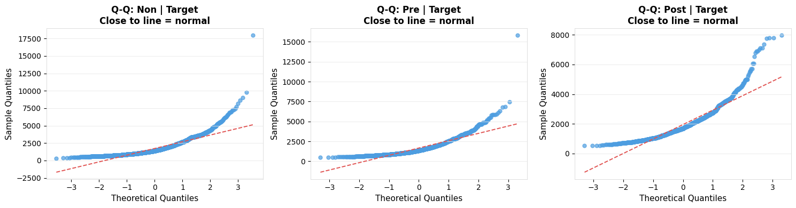
    


## 1.7 SAP 2.3 / 2.4 — RT Analysis


```python
rt_analysis(df_both_labeled, "Experiment 1")
```

    
    ═══════════════════════════════════════════════════════
      Experiment 1: RT Analysis (SAP 2.3/2.4)
      N participants: 51
    ═══════════════════════════════════════════════════════
    Shapiro-Wilk on cell means: W=0.8327, p=0.0000 → Non-normal → KW fallback
    
    --- Kruskal-Wallis: Boundary Position ---
      Kruskal-Wallis  H=13.5126,  p=0.0012  [Boundary Position]
    
    --- Bonferroni Pairwise Wilcoxon: Boundary Position ---
      Bonferroni Pairwise Wilcoxon [Boundary Position]


<style type="text/css">
</style>
<table id="T_7dbf1">
  <thead>
    <tr>
      <th id="T_7dbf1_level0_col0" class="col_heading level0 col0" >Comparison</th>
      <th id="T_7dbf1_level0_col1" class="col_heading level0 col1" >U</th>
      <th id="T_7dbf1_level0_col2" class="col_heading level0 col2" >p_raw</th>
      <th id="T_7dbf1_level0_col3" class="col_heading level0 col3" >p_bonferroni</th>
      <th id="T_7dbf1_level0_col4" class="col_heading level0 col4" >Significant</th>
    </tr>
  </thead>
  <tbody>
    <tr>
      <td id="T_7dbf1_row0_col0" class="data row0 col0" >Non vs Pre</td>
      <td id="T_7dbf1_row0_col1" class="data row0 col1" >1418.000000</td>
      <td id="T_7dbf1_row0_col2" class="data row0 col2" >0.433600</td>
      <td id="T_7dbf1_row0_col3" class="data row0 col3" >1.000000</td>
      <td id="T_7dbf1_row0_col4" class="data row0 col4" >False</td>
    </tr>
    <tr>
      <td id="T_7dbf1_row1_col0" class="data row1 col0" >Non vs Post</td>
      <td id="T_7dbf1_row1_col1" class="data row1 col1" >885.000000</td>
      <td id="T_7dbf1_row1_col2" class="data row1 col2" >0.005500</td>
      <td id="T_7dbf1_row1_col3" class="data row1 col3" >0.016500</td>
      <td id="T_7dbf1_row1_col4" class="data row1 col4" >True</td>
    </tr>
    <tr>
      <td id="T_7dbf1_row2_col0" class="data row2 col0" >Pre vs Post</td>
      <td id="T_7dbf1_row2_col1" class="data row2 col1" >786.000000</td>
      <td id="T_7dbf1_row2_col2" class="data row2 col2" >0.000600</td>
      <td id="T_7dbf1_row2_col3" class="data row2 col3" >0.001800</td>
      <td id="T_7dbf1_row2_col4" class="data row2 col4" >True</td>
    </tr>
  </tbody>
</table>


    
    --- Paired Wilcoxon: Trial Type (Target vs Lure) ---
    
    --- Interaction Proxy: Boundary within Target ---
      Kruskal-Wallis  H=13.5126,  p=0.0012  [Target boundary]
      Bonferroni Pairwise Wilcoxon [Target boundary]


<style type="text/css">
</style>
<table id="T_fbfb5">
  <thead>
    <tr>
      <th id="T_fbfb5_level0_col0" class="col_heading level0 col0" >Comparison</th>
      <th id="T_fbfb5_level0_col1" class="col_heading level0 col1" >U</th>
      <th id="T_fbfb5_level0_col2" class="col_heading level0 col2" >p_raw</th>
      <th id="T_fbfb5_level0_col3" class="col_heading level0 col3" >p_bonferroni</th>
      <th id="T_fbfb5_level0_col4" class="col_heading level0 col4" >Significant</th>
    </tr>
  </thead>
  <tbody>
    <tr>
      <td id="T_fbfb5_row0_col0" class="data row0 col0" >Non vs Pre</td>
      <td id="T_fbfb5_row0_col1" class="data row0 col1" >1418.000000</td>
      <td id="T_fbfb5_row0_col2" class="data row0 col2" >0.433600</td>
      <td id="T_fbfb5_row0_col3" class="data row0 col3" >1.000000</td>
      <td id="T_fbfb5_row0_col4" class="data row0 col4" >False</td>
    </tr>
    <tr>
      <td id="T_fbfb5_row1_col0" class="data row1 col0" >Non vs Post</td>
      <td id="T_fbfb5_row1_col1" class="data row1 col1" >885.000000</td>
      <td id="T_fbfb5_row1_col2" class="data row1 col2" >0.005500</td>
      <td id="T_fbfb5_row1_col3" class="data row1 col3" >0.016500</td>
      <td id="T_fbfb5_row1_col4" class="data row1 col4" >True</td>
    </tr>
    <tr>
      <td id="T_fbfb5_row2_col0" class="data row2 col0" >Pre vs Post</td>
      <td id="T_fbfb5_row2_col1" class="data row2 col1" >786.000000</td>
      <td id="T_fbfb5_row2_col2" class="data row2 col2" >0.000600</td>
      <td id="T_fbfb5_row2_col3" class="data row2 col3" >0.001800</td>
      <td id="T_fbfb5_row2_col4" class="data row2 col4" >True</td>
    </tr>
  </tbody>
</table>


    
    --- Interaction Proxy: Boundary within Lure ---
      Skipped – fewer than 2 groups: Lure boundary
      Skipped – fewer than 2 groups: Lure boundary


## 1.8 RT Descriptives


```python
summary_table(aggregate_rt(df_both_labeled),
              ["boundary_position","stimulus_type"],
              "mean_rt", "Exp 1: Mean RT per Participant per Cell (ms)")
```

    
    ───────────────────────────────────────────────────────
      Exp 1: Mean RT per Participant per Cell (ms)
    ───────────────────────────────────────────────────────


<style type="text/css">
</style>
<table id="T_08072">
  <thead>
    <tr>
      <th id="T_08072_level0_col0" class="col_heading level0 col0" >boundary_position</th>
      <th id="T_08072_level0_col1" class="col_heading level0 col1" >stimulus_type</th>
      <th id="T_08072_level0_col2" class="col_heading level0 col2" >n</th>
      <th id="T_08072_level0_col3" class="col_heading level0 col3" >Median</th>
      <th id="T_08072_level0_col4" class="col_heading level0 col4" >Mean</th>
      <th id="T_08072_level0_col5" class="col_heading level0 col5" >SD</th>
      <th id="T_08072_level0_col6" class="col_heading level0 col6" >IQR</th>
    </tr>
  </thead>
  <tbody>
    <tr>
      <td id="T_08072_row0_col0" class="data row0 col0" >Non</td>
      <td id="T_08072_row0_col1" class="data row0 col1" >Target</td>
      <td id="T_08072_row0_col2" class="data row0 col2" >51</td>
      <td id="T_08072_row0_col3" class="data row0 col3" >1657.185000</td>
      <td id="T_08072_row0_col4" class="data row0 col4" >1724.995000</td>
      <td id="T_08072_row0_col5" class="data row0 col5" >465.599000</td>
      <td id="T_08072_row0_col6" class="data row0 col6" >403.112000</td>
    </tr>
    <tr>
      <td id="T_08072_row1_col0" class="data row1 col0" >Pre</td>
      <td id="T_08072_row1_col1" class="data row1 col1" >Target</td>
      <td id="T_08072_row1_col2" class="data row1 col2" >51</td>
      <td id="T_08072_row1_col3" class="data row1 col3" >1599.813000</td>
      <td id="T_08072_row1_col4" class="data row1 col4" >1672.942000</td>
      <td id="T_08072_row1_col5" class="data row1 col5" >533.312000</td>
      <td id="T_08072_row1_col6" class="data row1 col6" >487.874000</td>
    </tr>
    <tr>
      <td id="T_08072_row2_col0" class="data row2 col0" >Post</td>
      <td id="T_08072_row2_col1" class="data row2 col1" >Target</td>
      <td id="T_08072_row2_col2" class="data row2 col2" >51</td>
      <td id="T_08072_row2_col3" class="data row2 col3" >1822.322000</td>
      <td id="T_08072_row2_col4" class="data row2 col4" >1950.070000</td>
      <td id="T_08072_row2_col5" class="data row2 col5" >518.301000</td>
      <td id="T_08072_row2_col6" class="data row2 col6" >506.548000</td>
    </tr>
  </tbody>
</table>


<div>
<style scoped>
    .dataframe tbody tr th:only-of-type {
        vertical-align: middle;
    }

    .dataframe tbody tr th {
        vertical-align: top;
    }

    .dataframe thead th {
        text-align: right;
    }
</style>
<table border="1" class="dataframe">
  <thead>
    <tr style="text-align: right;">
      <th></th>
      <th>boundary_position</th>
      <th>stimulus_type</th>
      <th>n</th>
      <th>Median</th>
      <th>Mean</th>
      <th>SD</th>
      <th>IQR</th>
    </tr>
  </thead>
  <tbody>
    <tr>
      <th>0</th>
      <td>Non</td>
      <td>Target</td>
      <td>51</td>
      <td>1657.1850</td>
      <td>1724.9950</td>
      <td>465.5990</td>
      <td>403.1120</td>
    </tr>
    <tr>
      <th>1</th>
      <td>Pre</td>
      <td>Target</td>
      <td>51</td>
      <td>1599.8130</td>
      <td>1672.9420</td>
      <td>533.3120</td>
      <td>487.8740</td>
    </tr>
    <tr>
      <th>2</th>
      <td>Post</td>
      <td>Target</td>
      <td>51</td>
      <td>1822.3220</td>
      <td>1950.0700</td>
      <td>518.3010</td>
      <td>506.5480</td>
    </tr>
  </tbody>
</table>
</div>


## 1.9 SAP 3.1 — REC and LDI


```python
mst_1 = compute_mst_scores(df_both_test)
display(mst_1[["participant_id","REC","LDI"]].round(3))
print("\nGroup summary:")
print(mst_1[["REC","LDI"]].agg(["median","std"]).round(3))
rec_ldi_plot(mst_1, "Exp 1: REC and LDI")
```


<div>
<style scoped>
    .dataframe tbody tr th:only-of-type {
        vertical-align: middle;
    }

    .dataframe tbody tr th {
        vertical-align: top;
    }

    .dataframe thead th {
        text-align: right;
    }
</style>
<table border="1" class="dataframe">
  <thead>
    <tr style="text-align: right;">
      <th></th>
      <th>participant_id</th>
      <th>REC</th>
      <th>LDI</th>
    </tr>
  </thead>
  <tbody>
    <tr>
      <th>0</th>
      <td>15</td>
      <td>0.2870</td>
      <td>0.1530</td>
    </tr>
    <tr>
      <th>1</th>
      <td>16</td>
      <td>0.2930</td>
      <td>0.2600</td>
    </tr>
    <tr>
      <th>2</th>
      <td>17</td>
      <td>0.2270</td>
      <td>0.2200</td>
    </tr>
    <tr>
      <th>3</th>
      <td>18</td>
      <td>0.3070</td>
      <td>0.1930</td>
    </tr>
    <tr>
      <th>4</th>
      <td>19</td>
      <td>0.2070</td>
      <td>0.1400</td>
    </tr>
    <tr>
      <th>5</th>
      <td>20</td>
      <td>0.1600</td>
      <td>0.2400</td>
    </tr>
    <tr>
      <th>6</th>
      <td>21</td>
      <td>0.2470</td>
      <td>0.1330</td>
    </tr>
    <tr>
      <th>7</th>
      <td>22</td>
      <td>0.2600</td>
      <td>0.1270</td>
    </tr>
    <tr>
      <th>8</th>
      <td>23</td>
      <td>0.2070</td>
      <td>0.2400</td>
    </tr>
    <tr>
      <th>9</th>
      <td>24</td>
      <td>0.3470</td>
      <td>0.1530</td>
    </tr>
    <tr>
      <th>10</th>
      <td>25</td>
      <td>0.2600</td>
      <td>0.1730</td>
    </tr>
    <tr>
      <th>11</th>
      <td>26</td>
      <td>0.2000</td>
      <td>0.2330</td>
    </tr>
    <tr>
      <th>12</th>
      <td>27</td>
      <td>0.3470</td>
      <td>0.2470</td>
    </tr>
    <tr>
      <th>13</th>
      <td>28</td>
      <td>0.2400</td>
      <td>0.1600</td>
    </tr>
    <tr>
      <th>14</th>
      <td>29</td>
      <td>0.2400</td>
      <td>0.3400</td>
    </tr>
    <tr>
      <th>15</th>
      <td>30</td>
      <td>0.1470</td>
      <td>0.1530</td>
    </tr>
    <tr>
      <th>16</th>
      <td>31</td>
      <td>0.2530</td>
      <td>0.2470</td>
    </tr>
    <tr>
      <th>17</th>
      <td>32</td>
      <td>0.3200</td>
      <td>0.1400</td>
    </tr>
    <tr>
      <th>18</th>
      <td>33</td>
      <td>0.1930</td>
      <td>0.1700</td>
    </tr>
    <tr>
      <th>19</th>
      <td>34</td>
      <td>0.2070</td>
      <td>0.2600</td>
    </tr>
    <tr>
      <th>20</th>
      <td>36</td>
      <td>0.2600</td>
      <td>0.1400</td>
    </tr>
    <tr>
      <th>21</th>
      <td>37</td>
      <td>0.3400</td>
      <td>0.0800</td>
    </tr>
    <tr>
      <th>22</th>
      <td>38</td>
      <td>0.1730</td>
      <td>0.2070</td>
    </tr>
    <tr>
      <th>23</th>
      <td>39</td>
      <td>0.3400</td>
      <td>0.1470</td>
    </tr>
    <tr>
      <th>24</th>
      <td>40</td>
      <td>0.3070</td>
      <td>0.1270</td>
    </tr>
    <tr>
      <th>25</th>
      <td>41</td>
      <td>0.1870</td>
      <td>0.3330</td>
    </tr>
    <tr>
      <th>26</th>
      <td>42</td>
      <td>0.2200</td>
      <td>0.1000</td>
    </tr>
    <tr>
      <th>27</th>
      <td>43</td>
      <td>0.2070</td>
      <td>0.1200</td>
    </tr>
    <tr>
      <th>28</th>
      <td>44</td>
      <td>0.3400</td>
      <td>0.1600</td>
    </tr>
    <tr>
      <th>29</th>
      <td>45</td>
      <td>0.2400</td>
      <td>0.1400</td>
    </tr>
    <tr>
      <th>30</th>
      <td>46</td>
      <td>0.3000</td>
      <td>0.1330</td>
    </tr>
    <tr>
      <th>31</th>
      <td>47</td>
      <td>0.2670</td>
      <td>0.2730</td>
    </tr>
    <tr>
      <th>32</th>
      <td>49</td>
      <td>0.1730</td>
      <td>0.1870</td>
    </tr>
    <tr>
      <th>33</th>
      <td>50</td>
      <td>0.2730</td>
      <td>0.2130</td>
    </tr>
    <tr>
      <th>34</th>
      <td>51</td>
      <td>0.2530</td>
      <td>0.2330</td>
    </tr>
    <tr>
      <th>35</th>
      <td>52</td>
      <td>0.3130</td>
      <td>0.1000</td>
    </tr>
    <tr>
      <th>36</th>
      <td>53</td>
      <td>0.2330</td>
      <td>0.2870</td>
    </tr>
    <tr>
      <th>37</th>
      <td>54</td>
      <td>0.3470</td>
      <td>0.1800</td>
    </tr>
    <tr>
      <th>38</th>
      <td>55</td>
      <td>0.2730</td>
      <td>0.0930</td>
    </tr>
    <tr>
      <th>39</th>
      <td>56</td>
      <td>0.2670</td>
      <td>0.1870</td>
    </tr>
    <tr>
      <th>40</th>
      <td>57</td>
      <td>0.2600</td>
      <td>0.2270</td>
    </tr>
    <tr>
      <th>41</th>
      <td>58</td>
      <td>0.2330</td>
      <td>0.1470</td>
    </tr>
    <tr>
      <th>42</th>
      <td>59</td>
      <td>0.2870</td>
      <td>0.2200</td>
    </tr>
    <tr>
      <th>43</th>
      <td>60</td>
      <td>0.2400</td>
      <td>0.1930</td>
    </tr>
    <tr>
      <th>44</th>
      <td>61</td>
      <td>0.2400</td>
      <td>0.1200</td>
    </tr>
    <tr>
      <th>45</th>
      <td>62</td>
      <td>0.3330</td>
      <td>0.1730</td>
    </tr>
    <tr>
      <th>46</th>
      <td>63</td>
      <td>0.2600</td>
      <td>0.1870</td>
    </tr>
    <tr>
      <th>47</th>
      <td>64</td>
      <td>0.2070</td>
      <td>0.1730</td>
    </tr>
    <tr>
      <th>48</th>
      <td>65</td>
      <td>0.2600</td>
      <td>0.2800</td>
    </tr>
    <tr>
      <th>49</th>
      <td>66</td>
      <td>0.3330</td>
      <td>0.2930</td>
    </tr>
    <tr>
      <th>50</th>
      <td>67</td>
      <td>0.3470</td>
      <td>0.1400</td>
    </tr>
  </tbody>
</table>
</div>


    
    Group summary:
              REC    LDI
    median 0.2600 0.1730
    std    0.0540 0.0620


    
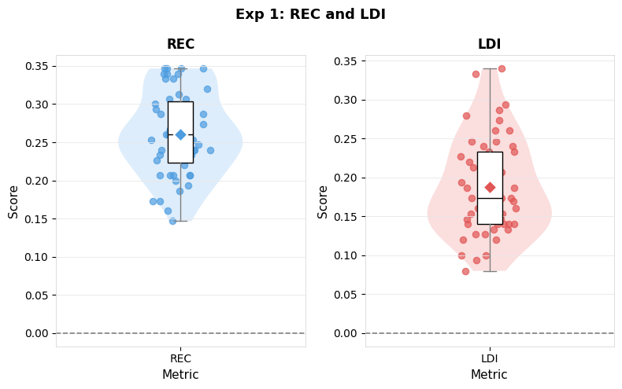
    


## 1.10 SAP 3.2 / 4 — Memory Accuracy by Boundary Condition


```python
bp_1 = compute_accuracy(df_both_test, df_both_task)
print(f"Participants: {bp_1.participant_id.nunique()}")
normality_table(
    [{"vals": grp.lure_CR.dropna().tolist(), "label": f"Lure CR | {bp}"}
     for bp, grp in bp_1.groupby("boundary_position", observed=True)],
    "Exp 1: Shapiro-Wilk — Lure CR")
normality_table(
    [{"vals": grp.target_hit.dropna().tolist(), "label": f"Target Hit | {bp}"}
     for bp, grp in bp_1.groupby("boundary_position", observed=True)],
    "Exp 1: Shapiro-Wilk — Target Hit")
summary_table(bp_1, "boundary_position", "lure_CR",    "Exp 1: Lure CR")
summary_table(bp_1, "boundary_position", "target_hit", "Exp 1: Target Hit")
```

    Participants: 51
    
    ───────────────────────────────────────────────────────
      Exp 1: Shapiro-Wilk — Lure CR
    ───────────────────────────────────────────────────────


<style type="text/css">
</style>
<table id="T_68eed">
  <thead>
    <tr>
      <th id="T_68eed_level0_col0" class="col_heading level0 col0" >Condition</th>
      <th id="T_68eed_level0_col1" class="col_heading level0 col1" >n</th>
      <th id="T_68eed_level0_col2" class="col_heading level0 col2" >W</th>
      <th id="T_68eed_level0_col3" class="col_heading level0 col3" >p</th>
      <th id="T_68eed_level0_col4" class="col_heading level0 col4" >Normal</th>
    </tr>
  </thead>
  <tbody>
    <tr>
      <td id="T_68eed_row0_col0" class="data row0 col0" >Lure CR | Non</td>
      <td id="T_68eed_row0_col1" class="data row0 col1" >51</td>
      <td id="T_68eed_row0_col2" class="data row0 col2" >nan</td>
      <td id="T_68eed_row0_col3" class="data row0 col3" >nan</td>
      <td id="T_68eed_row0_col4" class="data row0 col4" >Identical</td>
    </tr>
    <tr>
      <td id="T_68eed_row1_col0" class="data row1 col0" >Lure CR | Pre</td>
      <td id="T_68eed_row1_col1" class="data row1 col1" >51</td>
      <td id="T_68eed_row1_col2" class="data row1 col2" >nan</td>
      <td id="T_68eed_row1_col3" class="data row1 col3" >nan</td>
      <td id="T_68eed_row1_col4" class="data row1 col4" >Identical</td>
    </tr>
    <tr>
      <td id="T_68eed_row2_col0" class="data row2 col0" >Lure CR | Post</td>
      <td id="T_68eed_row2_col1" class="data row2 col1" >51</td>
      <td id="T_68eed_row2_col2" class="data row2 col2" >nan</td>
      <td id="T_68eed_row2_col3" class="data row2 col3" >nan</td>
      <td id="T_68eed_row2_col4" class="data row2 col4" >Identical</td>
    </tr>
  </tbody>
</table>


    
    ───────────────────────────────────────────────────────
      Exp 1: Shapiro-Wilk — Target Hit
    ───────────────────────────────────────────────────────


<style type="text/css">
</style>
<table id="T_d7c98">
  <thead>
    <tr>
      <th id="T_d7c98_level0_col0" class="col_heading level0 col0" >Condition</th>
      <th id="T_d7c98_level0_col1" class="col_heading level0 col1" >n</th>
      <th id="T_d7c98_level0_col2" class="col_heading level0 col2" >Normal</th>
    </tr>
  </thead>
  <tbody>
    <tr>
      <td id="T_d7c98_row0_col0" class="data row0 col0" >Target Hit | Non</td>
      <td id="T_d7c98_row0_col1" class="data row0 col1" >51</td>
      <td id="T_d7c98_row0_col2" class="data row0 col2" >Yes</td>
    </tr>
    <tr>
      <td id="T_d7c98_row1_col0" class="data row1 col0" >Target Hit | Pre</td>
      <td id="T_d7c98_row1_col1" class="data row1 col1" >51</td>
      <td id="T_d7c98_row1_col2" class="data row1 col2" >Yes</td>
    </tr>
    <tr>
      <td id="T_d7c98_row2_col0" class="data row2 col0" >Target Hit | Post</td>
      <td id="T_d7c98_row2_col1" class="data row2 col1" >51</td>
      <td id="T_d7c98_row2_col2" class="data row2 col2" >Yes</td>
    </tr>
  </tbody>
</table>


    
    ───────────────────────────────────────────────────────
      Exp 1: Lure CR
    ───────────────────────────────────────────────────────


<style type="text/css">
</style>
<table id="T_cc891">
  <thead>
    <tr>
      <th id="T_cc891_level0_col0" class="col_heading level0 col0" >boundary_position</th>
      <th id="T_cc891_level0_col1" class="col_heading level0 col1" >n</th>
      <th id="T_cc891_level0_col2" class="col_heading level0 col2" >Median</th>
      <th id="T_cc891_level0_col3" class="col_heading level0 col3" >Mean</th>
      <th id="T_cc891_level0_col4" class="col_heading level0 col4" >SD</th>
      <th id="T_cc891_level0_col5" class="col_heading level0 col5" >IQR</th>
    </tr>
  </thead>
  <tbody>
    <tr>
      <td id="T_cc891_row0_col0" class="data row0 col0" >Non</td>
      <td id="T_cc891_row0_col1" class="data row0 col1" >51</td>
      <td id="T_cc891_row0_col2" class="data row0 col2" >0.000000</td>
      <td id="T_cc891_row0_col3" class="data row0 col3" >0.000000</td>
      <td id="T_cc891_row0_col4" class="data row0 col4" >0.000000</td>
      <td id="T_cc891_row0_col5" class="data row0 col5" >0.000000</td>
    </tr>
    <tr>
      <td id="T_cc891_row1_col0" class="data row1 col0" >Pre</td>
      <td id="T_cc891_row1_col1" class="data row1 col1" >51</td>
      <td id="T_cc891_row1_col2" class="data row1 col2" >0.000000</td>
      <td id="T_cc891_row1_col3" class="data row1 col3" >0.000000</td>
      <td id="T_cc891_row1_col4" class="data row1 col4" >0.000000</td>
      <td id="T_cc891_row1_col5" class="data row1 col5" >0.000000</td>
    </tr>
    <tr>
      <td id="T_cc891_row2_col0" class="data row2 col0" >Post</td>
      <td id="T_cc891_row2_col1" class="data row2 col1" >51</td>
      <td id="T_cc891_row2_col2" class="data row2 col2" >0.000000</td>
      <td id="T_cc891_row2_col3" class="data row2 col3" >0.000000</td>
      <td id="T_cc891_row2_col4" class="data row2 col4" >0.000000</td>
      <td id="T_cc891_row2_col5" class="data row2 col5" >0.000000</td>
    </tr>
  </tbody>
</table>


    
    ───────────────────────────────────────────────────────
      Exp 1: Target Hit
    ───────────────────────────────────────────────────────


<style type="text/css">
</style>
<table id="T_761b9">
  <thead>
    <tr>
      <th id="T_761b9_level0_col0" class="col_heading level0 col0" >boundary_position</th>
      <th id="T_761b9_level0_col1" class="col_heading level0 col1" >n</th>
      <th id="T_761b9_level0_col2" class="col_heading level0 col2" >Median</th>
      <th id="T_761b9_level0_col3" class="col_heading level0 col3" >Mean</th>
      <th id="T_761b9_level0_col4" class="col_heading level0 col4" >SD</th>
      <th id="T_761b9_level0_col5" class="col_heading level0 col5" >IQR</th>
    </tr>
  </thead>
  <tbody>
    <tr>
      <td id="T_761b9_row0_col0" class="data row0 col0" >Non</td>
      <td id="T_761b9_row0_col1" class="data row0 col1" >51</td>
      <td id="T_761b9_row0_col2" class="data row0 col2" >0.532000</td>
      <td id="T_761b9_row0_col3" class="data row0 col3" >0.516000</td>
      <td id="T_761b9_row0_col4" class="data row0 col4" >0.110000</td>
      <td id="T_761b9_row0_col5" class="data row0 col5" >0.153000</td>
    </tr>
    <tr>
      <td id="T_761b9_row1_col0" class="data row1 col0" >Pre</td>
      <td id="T_761b9_row1_col1" class="data row1 col1" >51</td>
      <td id="T_761b9_row1_col2" class="data row1 col2" >0.577000</td>
      <td id="T_761b9_row1_col3" class="data row1 col3" >0.592000</td>
      <td id="T_761b9_row1_col4" class="data row1 col4" >0.131000</td>
      <td id="T_761b9_row1_col5" class="data row1 col5" >0.165000</td>
    </tr>
    <tr>
      <td id="T_761b9_row2_col0" class="data row2 col0" >Post</td>
      <td id="T_761b9_row2_col1" class="data row2 col1" >51</td>
      <td id="T_761b9_row2_col2" class="data row2 col2" >0.538000</td>
      <td id="T_761b9_row2_col3" class="data row2 col3" >0.545000</td>
      <td id="T_761b9_row2_col4" class="data row2 col4" >0.151000</td>
      <td id="T_761b9_row2_col5" class="data row2 col5" >0.200000</td>
    </tr>
  </tbody>
</table>


<div>
<style scoped>
    .dataframe tbody tr th:only-of-type {
        vertical-align: middle;
    }

    .dataframe tbody tr th {
        vertical-align: top;
    }

    .dataframe thead th {
        text-align: right;
    }
</style>
<table border="1" class="dataframe">
  <thead>
    <tr style="text-align: right;">
      <th></th>
      <th>boundary_position</th>
      <th>n</th>
      <th>Median</th>
      <th>Mean</th>
      <th>SD</th>
      <th>IQR</th>
    </tr>
  </thead>
  <tbody>
    <tr>
      <th>0</th>
      <td>Non</td>
      <td>51</td>
      <td>0.5320</td>
      <td>0.5160</td>
      <td>0.1100</td>
      <td>0.1530</td>
    </tr>
    <tr>
      <th>1</th>
      <td>Pre</td>
      <td>51</td>
      <td>0.5770</td>
      <td>0.5920</td>
      <td>0.1310</td>
      <td>0.1650</td>
    </tr>
    <tr>
      <th>2</th>
      <td>Post</td>
      <td>51</td>
      <td>0.5380</td>
      <td>0.5450</td>
      <td>0.1510</td>
      <td>0.2000</td>
    </tr>
  </tbody>
</table>
</div>


## 1.11 Accuracy Plots


```python
spaghetti_grouped(
    aggregate_rt(df_item_labeled),
    x_var="boundary_position",
    y_var="mean_rt",
    group_var="stimulus_type",
    title="Experiment 1: RT by Boundary Position and Trial Type",
    subtitle="Lines = individual participants; Points = median per cell",
    x_lab="Boundary Position",
    y_lab="Mean RT (ms)"
)
```


```python
spaghetti_plot(bp_1, "boundary_position", "lure_CR",
               title="Exp 1: Lure Correct Rejection",
               subtitle="Thin = participants | Bold = median + IQR",
               x_lab="Boundary Position", y_lab="Proportion Correct")
spaghetti_plot(bp_1, "boundary_position", "target_hit",
               title="Exp 1: Target Hit Rate",
               subtitle="Thin = participants | Bold = median + IQR",
               x_lab="Boundary Position", y_lab="Proportion Correct")
```


    
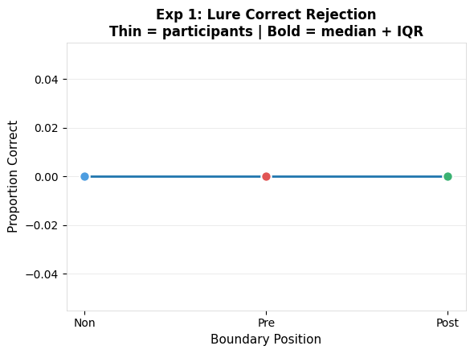
    


    
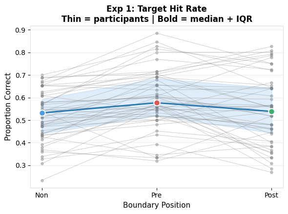
    


## 1.12 SAP 5 / 6 — RM Analysis + Post-Hoc


```python


rm_analysis(bp_1, "lure_CR", label="Exp 1: Lure CR")
rm_analysis(bp_1, "target_hit", label="Exp 1: Target Hit")
```

    
    ───────────────────────────────────────────────────────
      Exp 1: Lure CR: RM Analysis — DV: lure_CR
    ───────────────────────────────────────────────────────
      Participants included: 51  |  Dropped: 0
      Friedman: stat=nan, p=nan
    
      Bonferroni pairwise Wilcoxon (SAP 6):


<style type="text/css">
</style>
<table id="T_ef17d">
  <thead>
    <tr>
      <th id="T_ef17d_level0_col0" class="col_heading level0 col0" >Comparison</th>
      <th id="T_ef17d_level0_col1" class="col_heading level0 col1" >W</th>
      <th id="T_ef17d_level0_col2" class="col_heading level0 col2" >p_raw</th>
      <th id="T_ef17d_level0_col3" class="col_heading level0 col3" >p_bonferroni</th>
      <th id="T_ef17d_level0_col4" class="col_heading level0 col4" >Significant</th>
    </tr>
  </thead>
  <tbody>
    <tr>
      <td id="T_ef17d_row0_col0" class="data row0 col0" >Non vs Pre</td>
      <td id="T_ef17d_row0_col1" class="data row0 col1" >0.000000</td>
      <td id="T_ef17d_row0_col2" class="data row0 col2" >nan</td>
      <td id="T_ef17d_row0_col3" class="data row0 col3" >nan</td>
      <td id="T_ef17d_row0_col4" class="data row0 col4" >False</td>
    </tr>
    <tr>
      <td id="T_ef17d_row1_col0" class="data row1 col0" >Non vs Post</td>
      <td id="T_ef17d_row1_col1" class="data row1 col1" >0.000000</td>
      <td id="T_ef17d_row1_col2" class="data row1 col2" >nan</td>
      <td id="T_ef17d_row1_col3" class="data row1 col3" >nan</td>
      <td id="T_ef17d_row1_col4" class="data row1 col4" >False</td>
    </tr>
    <tr>
      <td id="T_ef17d_row2_col0" class="data row2 col0" >Pre vs Post</td>
      <td id="T_ef17d_row2_col1" class="data row2 col1" >0.000000</td>
      <td id="T_ef17d_row2_col2" class="data row2 col2" >nan</td>
      <td id="T_ef17d_row2_col3" class="data row2 col3" >nan</td>
      <td id="T_ef17d_row2_col4" class="data row2 col4" >False</td>
    </tr>
  </tbody>
</table>


    
    ───────────────────────────────────────────────────────
      Exp 1: Target Hit: RM Analysis — DV: target_hit
    ───────────────────────────────────────────────────────
      Participants included: 51  |  Dropped: 0
      Shapiro-Wilk: W=0.9910, p=0.4397 → Normal → RM-ANOVA


<div>
<style scoped>
    .dataframe tbody tr th:only-of-type {
        vertical-align: middle;
    }

    .dataframe tbody tr th {
        vertical-align: top;
    }

    .dataframe thead th {
        text-align: right;
    }
</style>
<table border="1" class="dataframe">
  <thead>
    <tr style="text-align: right;">
      <th></th>
      <th>Source</th>
      <th>SS</th>
      <th>DF</th>
      <th>MS</th>
      <th>F</th>
      <th>p_unc</th>
      <th>ng2</th>
      <th>eps</th>
    </tr>
  </thead>
  <tbody>
    <tr>
      <th>0</th>
      <td>boundary_position</td>
      <td>0.1472</td>
      <td>2</td>
      <td>0.0736</td>
      <td>13.8369</td>
      <td>0.0000</td>
      <td>0.0534</td>
      <td>0.9095</td>
    </tr>
    <tr>
      <th>1</th>
      <td>Error</td>
      <td>0.5320</td>
      <td>100</td>
      <td>0.0053</td>
      <td>NaN</td>
      <td>NaN</td>
      <td>NaN</td>
      <td>NaN</td>
    </tr>
  </tbody>
</table>
</div>


    
      Bonferroni pairwise t-tests (SAP 6):


<style type="text/css">
</style>
<table id="T_97726">
  <thead>
    <tr>
      <th id="T_97726_level0_col0" class="col_heading level0 col0" >Comparison</th>
      <th id="T_97726_level0_col1" class="col_heading level0 col1" >t</th>
      <th id="T_97726_level0_col2" class="col_heading level0 col2" >p_raw</th>
      <th id="T_97726_level0_col3" class="col_heading level0 col3" >p_bonferroni</th>
      <th id="T_97726_level0_col4" class="col_heading level0 col4" >Significant</th>
    </tr>
  </thead>
  <tbody>
    <tr>
      <td id="T_97726_row0_col0" class="data row0 col0" >Non vs Pre</td>
      <td id="T_97726_row0_col1" class="data row0 col1" >-3.140000</td>
      <td id="T_97726_row0_col2" class="data row0 col2" >0.002200</td>
      <td id="T_97726_row0_col3" class="data row0 col3" >0.006600</td>
      <td id="T_97726_row0_col4" class="data row0 col4" >True</td>
    </tr>
    <tr>
      <td id="T_97726_row1_col0" class="data row1 col0" >Non vs Post</td>
      <td id="T_97726_row1_col1" class="data row1 col1" >-1.081000</td>
      <td id="T_97726_row1_col2" class="data row1 col2" >0.282300</td>
      <td id="T_97726_row1_col3" class="data row1 col3" >0.846900</td>
      <td id="T_97726_row1_col4" class="data row1 col4" >False</td>
    </tr>
    <tr>
      <td id="T_97726_row2_col0" class="data row2 col0" >Pre vs Post</td>
      <td id="T_97726_row2_col1" class="data row2 col1" >1.672000</td>
      <td id="T_97726_row2_col2" class="data row2 col2" >0.097700</td>
      <td id="T_97726_row2_col3" class="data row2 col3" >0.293100</td>
      <td id="T_97726_row2_col4" class="data row2 col4" >False</td>
    </tr>
  </tbody>
</table>


<div>
<style scoped>
    .dataframe tbody tr th:only-of-type {
        vertical-align: middle;
    }

    .dataframe tbody tr th {
        vertical-align: top;
    }

    .dataframe thead th {
        text-align: right;
    }
</style>
<table border="1" class="dataframe">
  <thead>
    <tr style="text-align: right;">
      <th></th>
      <th>participant_id</th>
      <th>boundary_position</th>
      <th>target_hit</th>
    </tr>
  </thead>
  <tbody>
    <tr>
      <th>0</th>
      <td>15</td>
      <td>Non</td>
      <td>0.5319</td>
    </tr>
    <tr>
      <th>1</th>
      <td>15</td>
      <td>Pre</td>
      <td>0.6071</td>
    </tr>
    <tr>
      <th>2</th>
      <td>15</td>
      <td>Post</td>
      <td>0.7778</td>
    </tr>
    <tr>
      <th>3</th>
      <td>16</td>
      <td>Non</td>
      <td>0.6250</td>
    </tr>
    <tr>
      <th>4</th>
      <td>16</td>
      <td>Pre</td>
      <td>0.7037</td>
    </tr>
    <tr>
      <th>...</th>
      <td>...</td>
      <td>...</td>
      <td>...</td>
    </tr>
    <tr>
      <th>148</th>
      <td>66</td>
      <td>Pre</td>
      <td>0.8000</td>
    </tr>
    <tr>
      <th>149</th>
      <td>66</td>
      <td>Post</td>
      <td>0.8000</td>
    </tr>
    <tr>
      <th>150</th>
      <td>67</td>
      <td>Non</td>
      <td>0.6897</td>
    </tr>
    <tr>
      <th>151</th>
      <td>67</td>
      <td>Pre</td>
      <td>0.7037</td>
    </tr>
    <tr>
      <th>152</th>
      <td>67</td>
      <td>Post</td>
      <td>0.8077</td>
    </tr>
  </tbody>
</table>
<p>153 rows × 3 columns</p>
</div>


## 1.13 SAP 7 / 7.1 — Difference Scores


```python
diff_1 = compute_diff_scores(bp_1)
display(diff_1[["participant_id","lure_pre_diff","lure_post_diff",
                "target_pre_diff","target_post_diff"]].round(3))
one_sample_test_adaptive(diff_1.lure_pre_diff,    "Lure CR: Pre - Non (Exp 1)")
one_sample_test_adaptive(diff_1.lure_post_diff,   "Lure CR: Post - Non (Exp 1)")
one_sample_test_adaptive(diff_1.target_pre_diff,  "Target Hit: Pre - Non (Exp 1)")
one_sample_test_adaptive(diff_1.target_post_diff, "Target Hit: Post - Non (Exp 1)")
```


<div>
<style scoped>
    .dataframe tbody tr th:only-of-type {
        vertical-align: middle;
    }

    .dataframe tbody tr th {
        vertical-align: top;
    }

    .dataframe thead th {
        text-align: right;
    }
</style>
<table border="1" class="dataframe">
  <thead>
    <tr style="text-align: right;">
      <th></th>
      <th>participant_id</th>
      <th>lure_pre_diff</th>
      <th>lure_post_diff</th>
      <th>target_pre_diff</th>
      <th>target_post_diff</th>
    </tr>
  </thead>
  <tbody>
    <tr>
      <th>0</th>
      <td>15</td>
      <td>0.0000</td>
      <td>0.0000</td>
      <td>0.0750</td>
      <td>0.2460</td>
    </tr>
    <tr>
      <th>1</th>
      <td>16</td>
      <td>0.0000</td>
      <td>0.0000</td>
      <td>0.0790</td>
      <td>-0.0690</td>
    </tr>
    <tr>
      <th>2</th>
      <td>17</td>
      <td>0.0000</td>
      <td>0.0000</td>
      <td>0.0460</td>
      <td>0.1020</td>
    </tr>
    <tr>
      <th>3</th>
      <td>18</td>
      <td>0.0000</td>
      <td>0.0000</td>
      <td>0.0210</td>
      <td>0.0140</td>
    </tr>
    <tr>
      <th>4</th>
      <td>19</td>
      <td>0.0000</td>
      <td>0.0000</td>
      <td>0.0690</td>
      <td>0.0300</td>
    </tr>
    <tr>
      <th>5</th>
      <td>20</td>
      <td>0.0000</td>
      <td>0.0000</td>
      <td>0.2180</td>
      <td>0.1720</td>
    </tr>
    <tr>
      <th>6</th>
      <td>21</td>
      <td>0.0000</td>
      <td>0.0000</td>
      <td>0.0760</td>
      <td>0.0660</td>
    </tr>
    <tr>
      <th>7</th>
      <td>22</td>
      <td>0.0000</td>
      <td>0.0000</td>
      <td>-0.0290</td>
      <td>-0.0690</td>
    </tr>
    <tr>
      <th>8</th>
      <td>23</td>
      <td>0.0000</td>
      <td>0.0000</td>
      <td>0.1910</td>
      <td>-0.0130</td>
    </tr>
    <tr>
      <th>9</th>
      <td>24</td>
      <td>0.0000</td>
      <td>0.0000</td>
      <td>0.0970</td>
      <td>0.2090</td>
    </tr>
    <tr>
      <th>10</th>
      <td>25</td>
      <td>0.0000</td>
      <td>0.0000</td>
      <td>-0.0660</td>
      <td>-0.0430</td>
    </tr>
    <tr>
      <th>11</th>
      <td>26</td>
      <td>0.0000</td>
      <td>0.0000</td>
      <td>0.2390</td>
      <td>-0.1050</td>
    </tr>
    <tr>
      <th>12</th>
      <td>27</td>
      <td>0.0000</td>
      <td>0.0000</td>
      <td>0.1150</td>
      <td>0.0500</td>
    </tr>
    <tr>
      <th>13</th>
      <td>28</td>
      <td>0.0000</td>
      <td>0.0000</td>
      <td>0.0070</td>
      <td>-0.0320</td>
    </tr>
    <tr>
      <th>14</th>
      <td>29</td>
      <td>0.0000</td>
      <td>0.0000</td>
      <td>0.0680</td>
      <td>-0.0120</td>
    </tr>
    <tr>
      <th>15</th>
      <td>30</td>
      <td>0.0000</td>
      <td>0.0000</td>
      <td>0.0660</td>
      <td>-0.0580</td>
    </tr>
    <tr>
      <th>16</th>
      <td>31</td>
      <td>0.0000</td>
      <td>0.0000</td>
      <td>0.0950</td>
      <td>0.0440</td>
    </tr>
    <tr>
      <th>17</th>
      <td>32</td>
      <td>0.0000</td>
      <td>0.0000</td>
      <td>0.0380</td>
      <td>-0.0980</td>
    </tr>
    <tr>
      <th>18</th>
      <td>33</td>
      <td>0.0000</td>
      <td>0.0000</td>
      <td>-0.0490</td>
      <td>0.0770</td>
    </tr>
    <tr>
      <th>19</th>
      <td>34</td>
      <td>0.0000</td>
      <td>0.0000</td>
      <td>0.1630</td>
      <td>-0.1060</td>
    </tr>
    <tr>
      <th>20</th>
      <td>36</td>
      <td>0.0000</td>
      <td>0.0000</td>
      <td>-0.0120</td>
      <td>0.1090</td>
    </tr>
    <tr>
      <th>21</th>
      <td>37</td>
      <td>0.0000</td>
      <td>0.0000</td>
      <td>0.2120</td>
      <td>0.0780</td>
    </tr>
    <tr>
      <th>22</th>
      <td>38</td>
      <td>0.0000</td>
      <td>0.0000</td>
      <td>-0.0270</td>
      <td>-0.0270</td>
    </tr>
    <tr>
      <th>23</th>
      <td>39</td>
      <td>0.0000</td>
      <td>0.0000</td>
      <td>0.0280</td>
      <td>0.1050</td>
    </tr>
    <tr>
      <th>24</th>
      <td>40</td>
      <td>0.0000</td>
      <td>0.0000</td>
      <td>-0.0200</td>
      <td>-0.0130</td>
    </tr>
    <tr>
      <th>25</th>
      <td>41</td>
      <td>0.0000</td>
      <td>0.0000</td>
      <td>0.2480</td>
      <td>0.0450</td>
    </tr>
    <tr>
      <th>26</th>
      <td>42</td>
      <td>0.0000</td>
      <td>0.0000</td>
      <td>0.0660</td>
      <td>-0.0960</td>
    </tr>
    <tr>
      <th>27</th>
      <td>43</td>
      <td>0.0000</td>
      <td>0.0000</td>
      <td>0.1240</td>
      <td>-0.1090</td>
    </tr>
    <tr>
      <th>28</th>
      <td>44</td>
      <td>0.0000</td>
      <td>0.0000</td>
      <td>0.1920</td>
      <td>-0.0110</td>
    </tr>
    <tr>
      <th>29</th>
      <td>45</td>
      <td>0.0000</td>
      <td>0.0000</td>
      <td>0.0280</td>
      <td>0.1680</td>
    </tr>
    <tr>
      <th>30</th>
      <td>46</td>
      <td>0.0000</td>
      <td>0.0000</td>
      <td>0.0830</td>
      <td>0.0470</td>
    </tr>
    <tr>
      <th>31</th>
      <td>47</td>
      <td>0.0000</td>
      <td>0.0000</td>
      <td>-0.0360</td>
      <td>0.0300</td>
    </tr>
    <tr>
      <th>32</th>
      <td>49</td>
      <td>0.0000</td>
      <td>0.0000</td>
      <td>0.0950</td>
      <td>0.0450</td>
    </tr>
    <tr>
      <th>33</th>
      <td>50</td>
      <td>0.0000</td>
      <td>0.0000</td>
      <td>0.1440</td>
      <td>0.1320</td>
    </tr>
    <tr>
      <th>34</th>
      <td>51</td>
      <td>0.0000</td>
      <td>0.0000</td>
      <td>0.0770</td>
      <td>0.0770</td>
    </tr>
    <tr>
      <th>35</th>
      <td>52</td>
      <td>0.0000</td>
      <td>0.0000</td>
      <td>0.1540</td>
      <td>0.2470</td>
    </tr>
    <tr>
      <th>36</th>
      <td>53</td>
      <td>0.0000</td>
      <td>0.0000</td>
      <td>-0.2040</td>
      <td>-0.0190</td>
    </tr>
    <tr>
      <th>37</th>
      <td>54</td>
      <td>0.0000</td>
      <td>0.0000</td>
      <td>0.1030</td>
      <td>0.0570</td>
    </tr>
    <tr>
      <th>38</th>
      <td>55</td>
      <td>0.0000</td>
      <td>0.0000</td>
      <td>0.0730</td>
      <td>-0.0250</td>
    </tr>
    <tr>
      <th>39</th>
      <td>56</td>
      <td>0.0000</td>
      <td>0.0000</td>
      <td>0.0220</td>
      <td>-0.0390</td>
    </tr>
    <tr>
      <th>40</th>
      <td>57</td>
      <td>0.0000</td>
      <td>0.0000</td>
      <td>0.0370</td>
      <td>-0.0500</td>
    </tr>
    <tr>
      <th>41</th>
      <td>58</td>
      <td>0.0000</td>
      <td>0.0000</td>
      <td>0.1610</td>
      <td>0.0010</td>
    </tr>
    <tr>
      <th>42</th>
      <td>59</td>
      <td>0.0000</td>
      <td>0.0000</td>
      <td>0.0040</td>
      <td>-0.0450</td>
    </tr>
    <tr>
      <th>43</th>
      <td>60</td>
      <td>0.0000</td>
      <td>0.0000</td>
      <td>0.0530</td>
      <td>-0.0160</td>
    </tr>
    <tr>
      <th>44</th>
      <td>61</td>
      <td>0.0000</td>
      <td>0.0000</td>
      <td>0.0470</td>
      <td>-0.0600</td>
    </tr>
    <tr>
      <th>45</th>
      <td>62</td>
      <td>0.0000</td>
      <td>0.0000</td>
      <td>0.2590</td>
      <td>0.1510</td>
    </tr>
    <tr>
      <th>46</th>
      <td>63</td>
      <td>0.0000</td>
      <td>0.0000</td>
      <td>0.0370</td>
      <td>0.0250</td>
    </tr>
    <tr>
      <th>47</th>
      <td>64</td>
      <td>0.0000</td>
      <td>0.0000</td>
      <td>-0.0790</td>
      <td>-0.0410</td>
    </tr>
    <tr>
      <th>48</th>
      <td>65</td>
      <td>0.0000</td>
      <td>0.0000</td>
      <td>0.2040</td>
      <td>-0.0750</td>
    </tr>
    <tr>
      <th>49</th>
      <td>66</td>
      <td>0.0000</td>
      <td>0.0000</td>
      <td>0.2290</td>
      <td>0.2290</td>
    </tr>
    <tr>
      <th>50</th>
      <td>67</td>
      <td>0.0000</td>
      <td>0.0000</td>
      <td>0.0140</td>
      <td>0.1180</td>
    </tr>
  </tbody>
</table>
</div>


    
    --- Lure CR: Pre - Non (Exp 1) ---
      SW: W=1.0000, p=1.0000 → Normal → one-sample t
      t=nan, p=nan, mean=0.0000
    
    --- Lure CR: Post - Non (Exp 1) ---
      SW: W=1.0000, p=1.0000 → Normal → one-sample t
      t=nan, p=nan, mean=0.0000
    
    --- Target Hit: Pre - Non (Exp 1) ---
      SW: W=0.9728, p=0.2875 → Normal → one-sample t
      t=5.6834, p=0.0000, mean=0.0752
    
    --- Target Hit: Post - Non (Exp 1) ---
      SW: W=0.9454, p=0.0204 → Non-normal → Wilcoxon signed-rank
      W=488.0000, p=0.1009, median=0.0136


## 1.14 Difference Score Plot


```python
diff_score_plot(diff_1, "Exp 1: Difference Scores Relative to Non-Boundary Baseline")
```


    
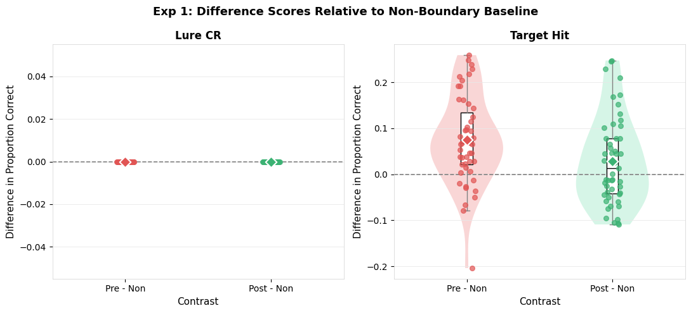
    


## 1.15 SAP 8 — Pre vs Post Paired Test


```python
paired_test_adaptive(bp_1, "lure_CR",    "Exp 1: Lure CR")
paired_test_adaptive(bp_1, "target_hit", "Exp 1: Target Hit")
```

    
    --- Exp 1: Lure CR: Paired Pre vs Post (SAP 8) ---
      Complete pairs: 51
      SW on diffs: W=1.0000, p=1.0000 → Normal → paired t
      SW on diffs: W=1.0000, p=1.0000 → Normal → paired t
      t=nan, p=nan
    
    --- Exp 1: Target Hit: Paired Pre vs Post (SAP 8) ---
      Complete pairs: 51
      SW on diffs: W=0.9851, p=0.7644 → Normal → paired t
      SW on diffs: W=0.9851, p=0.7644 → Normal → paired t
      t=2.8312, p=0.0067


## 1.16 SAP 9 — Linear Mixed-Effects Model


```python
run_lme_trial(df_both_labeled, "Exp 1")
```

    
    ═══════════════════════════════════════════════════════
      Exp 1: LME Models (SAP 9)
    ═══════════════════════════════════════════════════════
    
    --- Lure Correct Rejection ---
      Too few participants.
    
    --- Target Hit Rate ---
                             Mixed Linear Model Regression Results
    =======================================================================================
    Model:                       MixedLM           Dependent Variable:           target_hit
    No. Observations:            6294              Method:                       REML      
    No. Groups:                  51                Scale:                        0.2369    
    Min. group size:             107               Log-Likelihood:               inf       
    Max. group size:             402               Converged:                    Yes       
    Mean group size:             123.4                                                     
    ---------------------------------------------------------------------------------------
                                                   Coef. Std.Err.   z   P>|z| [0.025 0.975]
    ---------------------------------------------------------------------------------------
    Intercept                                      0.000                                   
    C(boundary_position, Treatment('Non'))[T.Pre]  0.066    0.015 4.296 0.000  0.036  0.096
    C(boundary_position, Treatment('Non'))[T.Post] 0.029    0.015 1.907 0.057 -0.001  0.060
    Group Var                                      0.000                                   
    =======================================================================================
    


## 1.17 SAP 10 — Lure Similarity Bin Analysis


```python
# lure_bin_analysis(
#     df_both_test,
#     df_both_task,
#     bins_obj=bins_obj_1,
#     bins_scenes=bins_scenes_1,
#     exp_label="Exp 1"
# )
```

---
# Experiment 2: Item Only
**Folder:** `../item_only/item_only_data/`  
**Bin files:** `../item_only/Set6 bins.txt` + `../item_only/SetScC bins.txt`  
**Scenes mapping:** `../item_only/scenes_mapping.txt`

## Exp 2 — Load Bin & Scenes Mapping Files


```python
bins_obj_2      = load_bin_file(data_path("item_only", "Set6 bins.txt"))
bins_scenes_2   = load_bin_file(data_path("item_only", "SetScC bins.txt"))
scenes_mapping  = load_scenes_mapping(data_path("item_only", "scenes_mapping.txt"))
print(f"Set6 bins: {len(bins_obj_2)} | SetScC bins: {len(bins_scenes_2)} | Scenes mapping: {len(scenes_mapping)}")
```

    Set6 bins: 192 | SetScC bins: 192 | Scenes mapping: 113


## 2.1 Load Task & Test Data


```python
df_item_task, df_item_test = load_experiment(
    task_pattern=data_path("item_only","item_only_data","*_MST_task_*.csv"),
    test_pattern=data_path("item_only","item_only_data","*_MST_test_*.csv"),
    exp_label="Experiment 2 (Item-Only)"
)
```

    Experiment 2 (Item-Only)  —  Task files: 56  |  Test files: 56


      Task participants: 53
      Test participants: 53


## 2.2 Participant Cross-Check


```python
in_task_only = set(df_item_task.participant_id.unique()) - set(df_item_test.participant_id.unique())
in_test_only = set(df_item_test.participant_id.unique()) - set(df_item_task.participant_id.unique())
print(f"In task only: {sorted(in_task_only)}")
print(f"In test only: {sorted(in_test_only)}")
```

    In task only: []
    In test only: []


## 2.3 Join Task and Test


```python
df_item_labeled = join_task_test(df_item_task, df_item_test)
print(f"Rows: {len(df_item_labeled)}  |  Participants: {df_item_labeled.participant_id.nunique()}")
```

    Rows: 6995  |  Participants: 53


## 2.4 SAP 2.2 — Normality: Encoding RT


```python
cells_rt_2 = [
    {"vals": grp["rt"].dropna().tolist(), "label": f"{bp} | {st}"}
    for (bp, st), grp in df_item_labeled.groupby(["boundary_position","stimulus_type"], observed=True)
]
normality_table(cells_rt_2, "Exp 2: Shapiro-Wilk — Encoding RT by Cell")
```

    
    ───────────────────────────────────────────────────────
      Exp 2: Shapiro-Wilk — Encoding RT by Cell
    ───────────────────────────────────────────────────────


<style type="text/css">
</style>
<table id="T_7af88">
  <thead>
    <tr>
      <th id="T_7af88_level0_col0" class="col_heading level0 col0" >Condition</th>
      <th id="T_7af88_level0_col1" class="col_heading level0 col1" >n</th>
      <th id="T_7af88_level0_col2" class="col_heading level0 col2" >Normal</th>
    </tr>
  </thead>
  <tbody>
    <tr>
      <td id="T_7af88_row0_col0" class="data row0 col0" >Non | Target</td>
      <td id="T_7af88_row0_col1" class="data row0 col1" >3874</td>
      <td id="T_7af88_row0_col2" class="data row0 col2" >No</td>
    </tr>
    <tr>
      <td id="T_7af88_row1_col0" class="data row1 col0" >Pre | Target</td>
      <td id="T_7af88_row1_col1" class="data row1 col1" >1558</td>
      <td id="T_7af88_row1_col2" class="data row1 col2" >No</td>
    </tr>
    <tr>
      <td id="T_7af88_row2_col0" class="data row2 col0" >Post | Target</td>
      <td id="T_7af88_row2_col1" class="data row2 col1" >1563</td>
      <td id="T_7af88_row2_col2" class="data row2 col2" >No</td>
    </tr>
  </tbody>
</table>


<div>
<style scoped>
    .dataframe tbody tr th:only-of-type {
        vertical-align: middle;
    }

    .dataframe tbody tr th {
        vertical-align: top;
    }

    .dataframe thead th {
        text-align: right;
    }
</style>
<table border="1" class="dataframe">
  <thead>
    <tr style="text-align: right;">
      <th></th>
      <th>Condition</th>
      <th>n</th>
      <th>Normal</th>
    </tr>
  </thead>
  <tbody>
    <tr>
      <th>0</th>
      <td>Non | Target</td>
      <td>3874</td>
      <td>No</td>
    </tr>
    <tr>
      <th>1</th>
      <td>Pre | Target</td>
      <td>1558</td>
      <td>No</td>
    </tr>
    <tr>
      <th>2</th>
      <td>Post | Target</td>
      <td>1563</td>
      <td>No</td>
    </tr>
  </tbody>
</table>
</div>


## 2.5 Q-Q Plots


```python
qq_plot_grid(cells_rt_2, ncols=3)
```


    
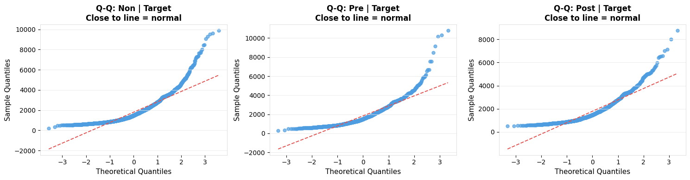
    


## 2.6 SAP 2.3 / 2.4 — RT Analysis


```python
rt_analysis(df_item_labeled, "Experiment 2")
```

    
    ═══════════════════════════════════════════════════════
      Experiment 2: RT Analysis (SAP 2.3/2.4)
      N participants: 53
    ═══════════════════════════════════════════════════════
    Shapiro-Wilk on cell means: W=0.8760, p=0.0000 → Non-normal → KW fallback
    
    --- Kruskal-Wallis: Boundary Position ---
      Kruskal-Wallis  H=0.2443,  p=0.8850  [Boundary Position]
    
    --- Bonferroni Pairwise Wilcoxon: Boundary Position ---
      Bonferroni Pairwise Wilcoxon [Boundary Position]


<style type="text/css">
</style>
<table id="T_722a7">
  <thead>
    <tr>
      <th id="T_722a7_level0_col0" class="col_heading level0 col0" >Comparison</th>
      <th id="T_722a7_level0_col1" class="col_heading level0 col1" >U</th>
      <th id="T_722a7_level0_col2" class="col_heading level0 col2" >p_raw</th>
      <th id="T_722a7_level0_col3" class="col_heading level0 col3" >p_bonferroni</th>
      <th id="T_722a7_level0_col4" class="col_heading level0 col4" >Significant</th>
    </tr>
  </thead>
  <tbody>
    <tr>
      <td id="T_722a7_row0_col0" class="data row0 col0" >Non vs Pre</td>
      <td id="T_722a7_row0_col1" class="data row0 col1" >1340.000000</td>
      <td id="T_722a7_row0_col2" class="data row0 col2" >0.685900</td>
      <td id="T_722a7_row0_col3" class="data row0 col3" >1.000000</td>
      <td id="T_722a7_row0_col4" class="data row0 col4" >False</td>
    </tr>
    <tr>
      <td id="T_722a7_row1_col0" class="data row1 col0" >Non vs Post</td>
      <td id="T_722a7_row1_col1" class="data row1 col1" >1409.000000</td>
      <td id="T_722a7_row1_col2" class="data row1 col2" >0.979800</td>
      <td id="T_722a7_row1_col3" class="data row1 col3" >1.000000</td>
      <td id="T_722a7_row1_col4" class="data row1 col4" >False</td>
    </tr>
    <tr>
      <td id="T_722a7_row2_col0" class="data row2 col0" >Pre vs Post</td>
      <td id="T_722a7_row2_col1" class="data row2 col1" >1475.000000</td>
      <td id="T_722a7_row2_col2" class="data row2 col2" >0.658300</td>
      <td id="T_722a7_row2_col3" class="data row2 col3" >1.000000</td>
      <td id="T_722a7_row2_col4" class="data row2 col4" >False</td>
    </tr>
  </tbody>
</table>


    
    --- Paired Wilcoxon: Trial Type (Target vs Lure) ---
    
    --- Interaction Proxy: Boundary within Target ---
      Kruskal-Wallis  H=0.2443,  p=0.8850  [Target boundary]
      Bonferroni Pairwise Wilcoxon [Target boundary]


<style type="text/css">
</style>
<table id="T_0a840">
  <thead>
    <tr>
      <th id="T_0a840_level0_col0" class="col_heading level0 col0" >Comparison</th>
      <th id="T_0a840_level0_col1" class="col_heading level0 col1" >U</th>
      <th id="T_0a840_level0_col2" class="col_heading level0 col2" >p_raw</th>
      <th id="T_0a840_level0_col3" class="col_heading level0 col3" >p_bonferroni</th>
      <th id="T_0a840_level0_col4" class="col_heading level0 col4" >Significant</th>
    </tr>
  </thead>
  <tbody>
    <tr>
      <td id="T_0a840_row0_col0" class="data row0 col0" >Non vs Pre</td>
      <td id="T_0a840_row0_col1" class="data row0 col1" >1340.000000</td>
      <td id="T_0a840_row0_col2" class="data row0 col2" >0.685900</td>
      <td id="T_0a840_row0_col3" class="data row0 col3" >1.000000</td>
      <td id="T_0a840_row0_col4" class="data row0 col4" >False</td>
    </tr>
    <tr>
      <td id="T_0a840_row1_col0" class="data row1 col0" >Non vs Post</td>
      <td id="T_0a840_row1_col1" class="data row1 col1" >1409.000000</td>
      <td id="T_0a840_row1_col2" class="data row1 col2" >0.979800</td>
      <td id="T_0a840_row1_col3" class="data row1 col3" >1.000000</td>
      <td id="T_0a840_row1_col4" class="data row1 col4" >False</td>
    </tr>
    <tr>
      <td id="T_0a840_row2_col0" class="data row2 col0" >Pre vs Post</td>
      <td id="T_0a840_row2_col1" class="data row2 col1" >1475.000000</td>
      <td id="T_0a840_row2_col2" class="data row2 col2" >0.658300</td>
      <td id="T_0a840_row2_col3" class="data row2 col3" >1.000000</td>
      <td id="T_0a840_row2_col4" class="data row2 col4" >False</td>
    </tr>
  </tbody>
</table>


    
    --- Interaction Proxy: Boundary within Lure ---
      Skipped – fewer than 2 groups: Lure boundary
      Skipped – fewer than 2 groups: Lure boundary


## 2.7 RT Descriptives and Plot


```python
summary_table(aggregate_rt(df_item_labeled),
              ["boundary_position","stimulus_type"],
              "mean_rt", "Exp 2: Mean RT per Participant per Cell (ms)")
spaghetti_grouped(
    aggregate_rt(df_item_labeled),
    x_var="boundary_position", y_var="mean_rt", group_var="stimulus_type",
    title="Exp 2: Encoding RT by Boundary Condition",
    subtitle="Thin = participants | Bold = median | Range = IQR",
    x_lab="Boundary Position", y_lab="Mean RT per Participant (ms)"
)
```

    
    ───────────────────────────────────────────────────────
      Exp 2: Mean RT per Participant per Cell (ms)
    ───────────────────────────────────────────────────────


<style type="text/css">
</style>
<table id="T_383c5">
  <thead>
    <tr>
      <th id="T_383c5_level0_col0" class="col_heading level0 col0" >boundary_position</th>
      <th id="T_383c5_level0_col1" class="col_heading level0 col1" >stimulus_type</th>
      <th id="T_383c5_level0_col2" class="col_heading level0 col2" >n</th>
      <th id="T_383c5_level0_col3" class="col_heading level0 col3" >Median</th>
      <th id="T_383c5_level0_col4" class="col_heading level0 col4" >Mean</th>
      <th id="T_383c5_level0_col5" class="col_heading level0 col5" >SD</th>
      <th id="T_383c5_level0_col6" class="col_heading level0 col6" >IQR</th>
    </tr>
  </thead>
  <tbody>
    <tr>
      <td id="T_383c5_row0_col0" class="data row0 col0" >Non</td>
      <td id="T_383c5_row0_col1" class="data row0 col1" >Target</td>
      <td id="T_383c5_row0_col2" class="data row0 col2" >53</td>
      <td id="T_383c5_row0_col3" class="data row0 col3" >1599.575000</td>
      <td id="T_383c5_row0_col4" class="data row0 col4" >1789.263000</td>
      <td id="T_383c5_row0_col5" class="data row0 col5" >564.719000</td>
      <td id="T_383c5_row0_col6" class="data row0 col6" >632.391000</td>
    </tr>
    <tr>
      <td id="T_383c5_row1_col0" class="data row1 col0" >Pre</td>
      <td id="T_383c5_row1_col1" class="data row1 col1" >Target</td>
      <td id="T_383c5_row1_col2" class="data row1 col2" >53</td>
      <td id="T_383c5_row1_col3" class="data row1 col3" >1718.089000</td>
      <td id="T_383c5_row1_col4" class="data row1 col4" >1818.994000</td>
      <td id="T_383c5_row1_col5" class="data row1 col5" >586.069000</td>
      <td id="T_383c5_row1_col6" class="data row1 col6" >503.101000</td>
    </tr>
    <tr>
      <td id="T_383c5_row2_col0" class="data row2 col0" >Post</td>
      <td id="T_383c5_row2_col1" class="data row2 col1" >Target</td>
      <td id="T_383c5_row2_col2" class="data row2 col2" >53</td>
      <td id="T_383c5_row2_col3" class="data row2 col3" >1638.829000</td>
      <td id="T_383c5_row2_col4" class="data row2 col4" >1777.478000</td>
      <td id="T_383c5_row2_col5" class="data row2 col5" >551.466000</td>
      <td id="T_383c5_row2_col6" class="data row2 col6" >512.995000</td>
    </tr>
  </tbody>
</table>


    
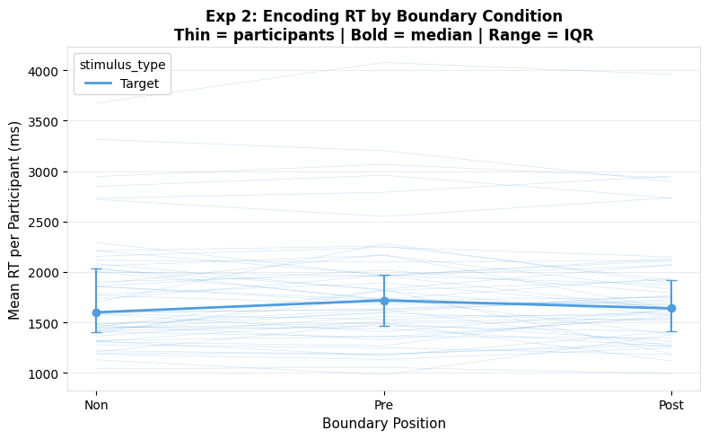
    


## 2.8 SAP 3.1 — REC and LDI


```python
mst_2 = compute_mst_scores(df_item_test)
display(mst_2[["participant_id","REC","LDI"]].round(3))
rec_ldi_plot(mst_2, "Exp 2: REC and LDI")
```


<div>
<style scoped>
    .dataframe tbody tr th:only-of-type {
        vertical-align: middle;
    }

    .dataframe tbody tr th {
        vertical-align: top;
    }

    .dataframe thead th {
        text-align: right;
    }
</style>
<table border="1" class="dataframe">
  <thead>
    <tr style="text-align: right;">
      <th></th>
      <th>participant_id</th>
      <th>REC</th>
      <th>LDI</th>
    </tr>
  </thead>
  <tbody>
    <tr>
      <th>0</th>
      <td>1</td>
      <td>0.2800</td>
      <td>0.2270</td>
    </tr>
    <tr>
      <th>1</th>
      <td>10</td>
      <td>0.3000</td>
      <td>0.1670</td>
    </tr>
    <tr>
      <th>2</th>
      <td>11</td>
      <td>0.3070</td>
      <td>0.2800</td>
    </tr>
    <tr>
      <th>3</th>
      <td>12</td>
      <td>0.1470</td>
      <td>0.2130</td>
    </tr>
    <tr>
      <th>4</th>
      <td>13</td>
      <td>0.2670</td>
      <td>0.2270</td>
    </tr>
    <tr>
      <th>5</th>
      <td>14</td>
      <td>0.1930</td>
      <td>0.1200</td>
    </tr>
    <tr>
      <th>6</th>
      <td>15</td>
      <td>0.2930</td>
      <td>0.3000</td>
    </tr>
    <tr>
      <th>7</th>
      <td>16</td>
      <td>0.3600</td>
      <td>0.1870</td>
    </tr>
    <tr>
      <th>8</th>
      <td>17</td>
      <td>0.3100</td>
      <td>0.1730</td>
    </tr>
    <tr>
      <th>9</th>
      <td>18</td>
      <td>0.3000</td>
      <td>0.2100</td>
    </tr>
    <tr>
      <th>10</th>
      <td>19</td>
      <td>0.2870</td>
      <td>0.2000</td>
    </tr>
    <tr>
      <th>11</th>
      <td>2</td>
      <td>0.2400</td>
      <td>0.1730</td>
    </tr>
    <tr>
      <th>12</th>
      <td>20</td>
      <td>0.2800</td>
      <td>0.2400</td>
    </tr>
    <tr>
      <th>13</th>
      <td>21</td>
      <td>0.3200</td>
      <td>0.1930</td>
    </tr>
    <tr>
      <th>14</th>
      <td>22</td>
      <td>0.2870</td>
      <td>0.1070</td>
    </tr>
    <tr>
      <th>15</th>
      <td>23</td>
      <td>0.2600</td>
      <td>0.2270</td>
    </tr>
    <tr>
      <th>16</th>
      <td>24</td>
      <td>0.2670</td>
      <td>0.0800</td>
    </tr>
    <tr>
      <th>17</th>
      <td>25</td>
      <td>0.2930</td>
      <td>0.1870</td>
    </tr>
    <tr>
      <th>18</th>
      <td>26</td>
      <td>0.2930</td>
      <td>0.2730</td>
    </tr>
    <tr>
      <th>19</th>
      <td>27</td>
      <td>0.2730</td>
      <td>0.2200</td>
    </tr>
    <tr>
      <th>20</th>
      <td>28</td>
      <td>0.3600</td>
      <td>0.1470</td>
    </tr>
    <tr>
      <th>21</th>
      <td>29</td>
      <td>0.1670</td>
      <td>0.3070</td>
    </tr>
    <tr>
      <th>22</th>
      <td>3</td>
      <td>0.2270</td>
      <td>0.1270</td>
    </tr>
    <tr>
      <th>23</th>
      <td>30</td>
      <td>0.3070</td>
      <td>0.2070</td>
    </tr>
    <tr>
      <th>24</th>
      <td>31</td>
      <td>0.3670</td>
      <td>0.2800</td>
    </tr>
    <tr>
      <th>25</th>
      <td>32</td>
      <td>0.2170</td>
      <td>0.2100</td>
    </tr>
    <tr>
      <th>26</th>
      <td>33</td>
      <td>0.2730</td>
      <td>0.1200</td>
    </tr>
    <tr>
      <th>27</th>
      <td>34</td>
      <td>0.3070</td>
      <td>0.1730</td>
    </tr>
    <tr>
      <th>28</th>
      <td>35</td>
      <td>0.2400</td>
      <td>0.2130</td>
    </tr>
    <tr>
      <th>29</th>
      <td>36</td>
      <td>0.3470</td>
      <td>0.1600</td>
    </tr>
    <tr>
      <th>30</th>
      <td>37</td>
      <td>0.3400</td>
      <td>0.2870</td>
    </tr>
    <tr>
      <th>31</th>
      <td>38</td>
      <td>0.2600</td>
      <td>0.3070</td>
    </tr>
    <tr>
      <th>32</th>
      <td>39</td>
      <td>0.2870</td>
      <td>0.3200</td>
    </tr>
    <tr>
      <th>33</th>
      <td>4</td>
      <td>0.2670</td>
      <td>0.2270</td>
    </tr>
    <tr>
      <th>34</th>
      <td>40</td>
      <td>0.2400</td>
      <td>0.2070</td>
    </tr>
    <tr>
      <th>35</th>
      <td>41</td>
      <td>0.2870</td>
      <td>0.2600</td>
    </tr>
    <tr>
      <th>36</th>
      <td>42</td>
      <td>0.1670</td>
      <td>0.2400</td>
    </tr>
    <tr>
      <th>37</th>
      <td>43</td>
      <td>0.1470</td>
      <td>0.1530</td>
    </tr>
    <tr>
      <th>38</th>
      <td>44</td>
      <td>0.2470</td>
      <td>0.1330</td>
    </tr>
    <tr>
      <th>39</th>
      <td>45</td>
      <td>0.3330</td>
      <td>0.3000</td>
    </tr>
    <tr>
      <th>40</th>
      <td>46</td>
      <td>0.3600</td>
      <td>0.1070</td>
    </tr>
    <tr>
      <th>41</th>
      <td>47</td>
      <td>0.2800</td>
      <td>0.2600</td>
    </tr>
    <tr>
      <th>42</th>
      <td>48</td>
      <td>0.3200</td>
      <td>0.1800</td>
    </tr>
    <tr>
      <th>43</th>
      <td>49</td>
      <td>0.2070</td>
      <td>0.1730</td>
    </tr>
    <tr>
      <th>44</th>
      <td>5</td>
      <td>0.3070</td>
      <td>0.2400</td>
    </tr>
    <tr>
      <th>45</th>
      <td>50</td>
      <td>0.3200</td>
      <td>0.2400</td>
    </tr>
    <tr>
      <th>46</th>
      <td>51</td>
      <td>0.2870</td>
      <td>0.1400</td>
    </tr>
    <tr>
      <th>47</th>
      <td>52</td>
      <td>0.2000</td>
      <td>0.1670</td>
    </tr>
    <tr>
      <th>48</th>
      <td>53</td>
      <td>0.1800</td>
      <td>0.1930</td>
    </tr>
    <tr>
      <th>49</th>
      <td>54</td>
      <td>0.1470</td>
      <td>0.1400</td>
    </tr>
    <tr>
      <th>50</th>
      <td>6</td>
      <td>0.3070</td>
      <td>0.2070</td>
    </tr>
    <tr>
      <th>51</th>
      <td>8</td>
      <td>0.3130</td>
      <td>0.2130</td>
    </tr>
    <tr>
      <th>52</th>
      <td>9</td>
      <td>0.2470</td>
      <td>0.2270</td>
    </tr>
  </tbody>
</table>
</div>


    
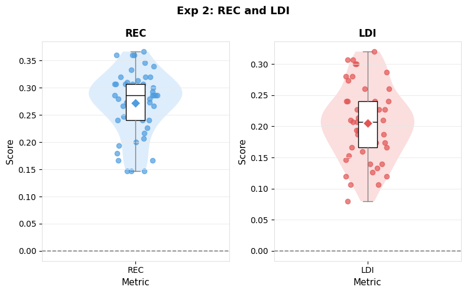
    


## 2.9 SAP 3.2 / 4 — Memory Accuracy


```python
bp_2 = compute_accuracy(df_item_test, df_item_task)
print(f"Participants: {bp_2.participant_id.nunique()}")
summary_table(bp_2, "boundary_position", "lure_CR",    "Exp 2: Lure CR")
summary_table(bp_2, "boundary_position", "target_hit", "Exp 2: Target Hit")
```

    Participants: 53
    
    ───────────────────────────────────────────────────────
      Exp 2: Lure CR
    ───────────────────────────────────────────────────────


<style type="text/css">
</style>
<table id="T_5d838">
  <thead>
    <tr>
      <th id="T_5d838_level0_col0" class="col_heading level0 col0" >boundary_position</th>
      <th id="T_5d838_level0_col1" class="col_heading level0 col1" >n</th>
      <th id="T_5d838_level0_col2" class="col_heading level0 col2" >Median</th>
      <th id="T_5d838_level0_col3" class="col_heading level0 col3" >Mean</th>
      <th id="T_5d838_level0_col4" class="col_heading level0 col4" >SD</th>
      <th id="T_5d838_level0_col5" class="col_heading level0 col5" >IQR</th>
    </tr>
  </thead>
  <tbody>
    <tr>
      <td id="T_5d838_row0_col0" class="data row0 col0" >Non</td>
      <td id="T_5d838_row0_col1" class="data row0 col1" >53</td>
      <td id="T_5d838_row0_col2" class="data row0 col2" >0.000000</td>
      <td id="T_5d838_row0_col3" class="data row0 col3" >0.000000</td>
      <td id="T_5d838_row0_col4" class="data row0 col4" >0.000000</td>
      <td id="T_5d838_row0_col5" class="data row0 col5" >0.000000</td>
    </tr>
    <tr>
      <td id="T_5d838_row1_col0" class="data row1 col0" >Pre</td>
      <td id="T_5d838_row1_col1" class="data row1 col1" >53</td>
      <td id="T_5d838_row1_col2" class="data row1 col2" >0.000000</td>
      <td id="T_5d838_row1_col3" class="data row1 col3" >0.000000</td>
      <td id="T_5d838_row1_col4" class="data row1 col4" >0.000000</td>
      <td id="T_5d838_row1_col5" class="data row1 col5" >0.000000</td>
    </tr>
    <tr>
      <td id="T_5d838_row2_col0" class="data row2 col0" >Post</td>
      <td id="T_5d838_row2_col1" class="data row2 col1" >53</td>
      <td id="T_5d838_row2_col2" class="data row2 col2" >0.000000</td>
      <td id="T_5d838_row2_col3" class="data row2 col3" >0.000000</td>
      <td id="T_5d838_row2_col4" class="data row2 col4" >0.000000</td>
      <td id="T_5d838_row2_col5" class="data row2 col5" >0.000000</td>
    </tr>
  </tbody>
</table>


    
    ───────────────────────────────────────────────────────
      Exp 2: Target Hit
    ───────────────────────────────────────────────────────


<style type="text/css">
</style>
<table id="T_38102">
  <thead>
    <tr>
      <th id="T_38102_level0_col0" class="col_heading level0 col0" >boundary_position</th>
      <th id="T_38102_level0_col1" class="col_heading level0 col1" >n</th>
      <th id="T_38102_level0_col2" class="col_heading level0 col2" >Median</th>
      <th id="T_38102_level0_col3" class="col_heading level0 col3" >Mean</th>
      <th id="T_38102_level0_col4" class="col_heading level0 col4" >SD</th>
      <th id="T_38102_level0_col5" class="col_heading level0 col5" >IQR</th>
    </tr>
  </thead>
  <tbody>
    <tr>
      <td id="T_38102_row0_col0" class="data row0 col0" >Non</td>
      <td id="T_38102_row0_col1" class="data row0 col1" >53</td>
      <td id="T_38102_row0_col2" class="data row0 col2" >0.564000</td>
      <td id="T_38102_row0_col3" class="data row0 col3" >0.542000</td>
      <td id="T_38102_row0_col4" class="data row0 col4" >0.115000</td>
      <td id="T_38102_row0_col5" class="data row0 col5" >0.133000</td>
    </tr>
    <tr>
      <td id="T_38102_row1_col0" class="data row1 col0" >Pre</td>
      <td id="T_38102_row1_col1" class="data row1 col1" >53</td>
      <td id="T_38102_row1_col2" class="data row1 col2" >0.613000</td>
      <td id="T_38102_row1_col3" class="data row1 col3" >0.599000</td>
      <td id="T_38102_row1_col4" class="data row1 col4" >0.149000</td>
      <td id="T_38102_row1_col5" class="data row1 col5" >0.157000</td>
    </tr>
    <tr>
      <td id="T_38102_row2_col0" class="data row2 col0" >Post</td>
      <td id="T_38102_row2_col1" class="data row2 col1" >53</td>
      <td id="T_38102_row2_col2" class="data row2 col2" >0.625000</td>
      <td id="T_38102_row2_col3" class="data row2 col3" >0.618000</td>
      <td id="T_38102_row2_col4" class="data row2 col4" >0.154000</td>
      <td id="T_38102_row2_col5" class="data row2 col5" >0.184000</td>
    </tr>
  </tbody>
</table>


<div>
<style scoped>
    .dataframe tbody tr th:only-of-type {
        vertical-align: middle;
    }

    .dataframe tbody tr th {
        vertical-align: top;
    }

    .dataframe thead th {
        text-align: right;
    }
</style>
<table border="1" class="dataframe">
  <thead>
    <tr style="text-align: right;">
      <th></th>
      <th>boundary_position</th>
      <th>n</th>
      <th>Median</th>
      <th>Mean</th>
      <th>SD</th>
      <th>IQR</th>
    </tr>
  </thead>
  <tbody>
    <tr>
      <th>0</th>
      <td>Non</td>
      <td>53</td>
      <td>0.5640</td>
      <td>0.5420</td>
      <td>0.1150</td>
      <td>0.1330</td>
    </tr>
    <tr>
      <th>1</th>
      <td>Pre</td>
      <td>53</td>
      <td>0.6130</td>
      <td>0.5990</td>
      <td>0.1490</td>
      <td>0.1570</td>
    </tr>
    <tr>
      <th>2</th>
      <td>Post</td>
      <td>53</td>
      <td>0.6250</td>
      <td>0.6180</td>
      <td>0.1540</td>
      <td>0.1840</td>
    </tr>
  </tbody>
</table>
</div>


## 2.10 Accuracy Plots


```python
spaghetti_plot(bp_2, "boundary_position", "lure_CR",
               title="Exp 2: Lure Correct Rejection", x_lab="Boundary Position", y_lab="Proportion Correct")
spaghetti_plot(bp_2, "boundary_position", "target_hit",
               title="Exp 2: Target Hit Rate", x_lab="Boundary Position", y_lab="Proportion Correct")
```


    
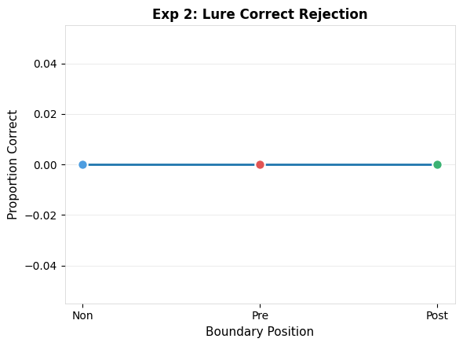
    


    
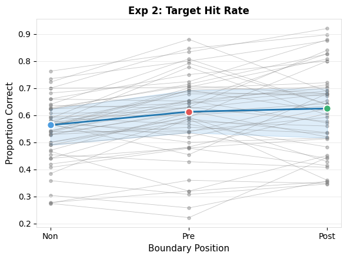
    


## 2.11 SAP 5 / 6 — RM Analysis


```python
rm_analysis(bp_2, "lure_CR",    label="Exp 2: Lure CR")
rm_analysis(bp_2, "target_hit", label="Exp 2: Target Hit")
```

    
    ───────────────────────────────────────────────────────
      Exp 2: Lure CR: RM Analysis — DV: lure_CR
    ───────────────────────────────────────────────────────
      Participants included: 53  |  Dropped: 0
      Friedman: stat=nan, p=nan
    
      Bonferroni pairwise Wilcoxon (SAP 6):


<style type="text/css">
</style>
<table id="T_40740">
  <thead>
    <tr>
      <th id="T_40740_level0_col0" class="col_heading level0 col0" >Comparison</th>
      <th id="T_40740_level0_col1" class="col_heading level0 col1" >W</th>
      <th id="T_40740_level0_col2" class="col_heading level0 col2" >p_raw</th>
      <th id="T_40740_level0_col3" class="col_heading level0 col3" >p_bonferroni</th>
      <th id="T_40740_level0_col4" class="col_heading level0 col4" >Significant</th>
    </tr>
  </thead>
  <tbody>
    <tr>
      <td id="T_40740_row0_col0" class="data row0 col0" >Non vs Pre</td>
      <td id="T_40740_row0_col1" class="data row0 col1" >0.000000</td>
      <td id="T_40740_row0_col2" class="data row0 col2" >nan</td>
      <td id="T_40740_row0_col3" class="data row0 col3" >nan</td>
      <td id="T_40740_row0_col4" class="data row0 col4" >False</td>
    </tr>
    <tr>
      <td id="T_40740_row1_col0" class="data row1 col0" >Non vs Post</td>
      <td id="T_40740_row1_col1" class="data row1 col1" >0.000000</td>
      <td id="T_40740_row1_col2" class="data row1 col2" >nan</td>
      <td id="T_40740_row1_col3" class="data row1 col3" >nan</td>
      <td id="T_40740_row1_col4" class="data row1 col4" >False</td>
    </tr>
    <tr>
      <td id="T_40740_row2_col0" class="data row2 col0" >Pre vs Post</td>
      <td id="T_40740_row2_col1" class="data row2 col1" >0.000000</td>
      <td id="T_40740_row2_col2" class="data row2 col2" >nan</td>
      <td id="T_40740_row2_col3" class="data row2 col3" >nan</td>
      <td id="T_40740_row2_col4" class="data row2 col4" >False</td>
    </tr>
  </tbody>
</table>


    
    ───────────────────────────────────────────────────────
      Exp 2: Target Hit: RM Analysis — DV: target_hit
    ───────────────────────────────────────────────────────
      Participants included: 53  |  Dropped: 0
      Shapiro-Wilk: W=0.9876, p=0.1736 → Normal → RM-ANOVA


<div>
<style scoped>
    .dataframe tbody tr th:only-of-type {
        vertical-align: middle;
    }

    .dataframe tbody tr th {
        vertical-align: top;
    }

    .dataframe thead th {
        text-align: right;
    }
</style>
<table border="1" class="dataframe">
  <thead>
    <tr style="text-align: right;">
      <th></th>
      <th>Source</th>
      <th>SS</th>
      <th>DF</th>
      <th>MS</th>
      <th>F</th>
      <th>p_unc</th>
      <th>p_GG_corr</th>
      <th>ng2</th>
      <th>eps</th>
      <th>sphericity</th>
      <th>W_spher</th>
      <th>p_spher</th>
    </tr>
  </thead>
  <tbody>
    <tr>
      <th>0</th>
      <td>boundary_position</td>
      <td>0.1646</td>
      <td>2</td>
      <td>0.0823</td>
      <td>19.4279</td>
      <td>0.0000</td>
      <td>0.0000</td>
      <td>0.0506</td>
      <td>0.8749</td>
      <td>False</td>
      <td>0.8570</td>
      <td>0.0196</td>
    </tr>
    <tr>
      <th>1</th>
      <td>Error</td>
      <td>0.4406</td>
      <td>104</td>
      <td>0.0042</td>
      <td>NaN</td>
      <td>NaN</td>
      <td>NaN</td>
      <td>NaN</td>
      <td>NaN</td>
      <td>NaN</td>
      <td>NaN</td>
      <td>NaN</td>
    </tr>
  </tbody>
</table>
</div>


    
      Bonferroni pairwise t-tests (SAP 6):


<style type="text/css">
</style>
<table id="T_92a58">
  <thead>
    <tr>
      <th id="T_92a58_level0_col0" class="col_heading level0 col0" >Comparison</th>
      <th id="T_92a58_level0_col1" class="col_heading level0 col1" >t</th>
      <th id="T_92a58_level0_col2" class="col_heading level0 col2" >p_raw</th>
      <th id="T_92a58_level0_col3" class="col_heading level0 col3" >p_bonferroni</th>
      <th id="T_92a58_level0_col4" class="col_heading level0 col4" >Significant</th>
    </tr>
  </thead>
  <tbody>
    <tr>
      <td id="T_92a58_row0_col0" class="data row0 col0" >Non vs Pre</td>
      <td id="T_92a58_row0_col1" class="data row0 col1" >-2.212000</td>
      <td id="T_92a58_row0_col2" class="data row0 col2" >0.029200</td>
      <td id="T_92a58_row0_col3" class="data row0 col3" >0.087600</td>
      <td id="T_92a58_row0_col4" class="data row0 col4" >False</td>
    </tr>
    <tr>
      <td id="T_92a58_row1_col0" class="data row1 col0" >Non vs Post</td>
      <td id="T_92a58_row1_col1" class="data row1 col1" >-2.855000</td>
      <td id="T_92a58_row1_col2" class="data row1 col2" >0.005200</td>
      <td id="T_92a58_row1_col3" class="data row1 col3" >0.015600</td>
      <td id="T_92a58_row1_col4" class="data row1 col4" >True</td>
    </tr>
    <tr>
      <td id="T_92a58_row2_col0" class="data row2 col0" >Pre vs Post</td>
      <td id="T_92a58_row2_col1" class="data row2 col1" >-0.618000</td>
      <td id="T_92a58_row2_col2" class="data row2 col2" >0.538000</td>
      <td id="T_92a58_row2_col3" class="data row2 col3" >1.000000</td>
      <td id="T_92a58_row2_col4" class="data row2 col4" >False</td>
    </tr>
  </tbody>
</table>


<div>
<style scoped>
    .dataframe tbody tr th:only-of-type {
        vertical-align: middle;
    }

    .dataframe tbody tr th {
        vertical-align: top;
    }

    .dataframe thead th {
        text-align: right;
    }
</style>
<table border="1" class="dataframe">
  <thead>
    <tr style="text-align: right;">
      <th></th>
      <th>participant_id</th>
      <th>boundary_position</th>
      <th>target_hit</th>
    </tr>
  </thead>
  <tbody>
    <tr>
      <th>0</th>
      <td>1</td>
      <td>Non</td>
      <td>0.5667</td>
    </tr>
    <tr>
      <th>1</th>
      <td>1</td>
      <td>Pre</td>
      <td>0.4545</td>
    </tr>
    <tr>
      <th>2</th>
      <td>1</td>
      <td>Post</td>
      <td>0.6800</td>
    </tr>
    <tr>
      <th>3</th>
      <td>10</td>
      <td>Non</td>
      <td>0.5714</td>
    </tr>
    <tr>
      <th>4</th>
      <td>10</td>
      <td>Pre</td>
      <td>0.6538</td>
    </tr>
    <tr>
      <th>...</th>
      <td>...</td>
      <td>...</td>
      <td>...</td>
    </tr>
    <tr>
      <th>154</th>
      <td>8</td>
      <td>Pre</td>
      <td>0.7143</td>
    </tr>
    <tr>
      <th>155</th>
      <td>8</td>
      <td>Post</td>
      <td>0.8261</td>
    </tr>
    <tr>
      <th>156</th>
      <td>9</td>
      <td>Non</td>
      <td>0.4902</td>
    </tr>
    <tr>
      <th>157</th>
      <td>9</td>
      <td>Pre</td>
      <td>0.5357</td>
    </tr>
    <tr>
      <th>158</th>
      <td>9</td>
      <td>Post</td>
      <td>0.4400</td>
    </tr>
  </tbody>
</table>
<p>159 rows × 3 columns</p>
</div>


## 2.12 SAP 7 / 7.1 — Difference Scores


```python
diff_2 = compute_diff_scores(bp_2)
display(diff_2[["participant_id","lure_pre_diff","lure_post_diff",
                "target_pre_diff","target_post_diff"]].round(3))
one_sample_test_adaptive(diff_2.lure_pre_diff,    "Lure CR: Pre - Non (Exp 2)")
one_sample_test_adaptive(diff_2.lure_post_diff,   "Lure CR: Post - Non (Exp 2)")
one_sample_test_adaptive(diff_2.target_pre_diff,  "Target Hit: Pre - Non (Exp 2)")
one_sample_test_adaptive(diff_2.target_post_diff, "Target Hit: Post - Non (Exp 2)")
diff_score_plot(diff_2, "Exp 2: Difference Scores Relative to Non-Boundary Baseline")
```


<div>
<style scoped>
    .dataframe tbody tr th:only-of-type {
        vertical-align: middle;
    }

    .dataframe tbody tr th {
        vertical-align: top;
    }

    .dataframe thead th {
        text-align: right;
    }
</style>
<table border="1" class="dataframe">
  <thead>
    <tr style="text-align: right;">
      <th></th>
      <th>participant_id</th>
      <th>lure_pre_diff</th>
      <th>lure_post_diff</th>
      <th>target_pre_diff</th>
      <th>target_post_diff</th>
    </tr>
  </thead>
  <tbody>
    <tr>
      <th>0</th>
      <td>1</td>
      <td>0.0000</td>
      <td>0.0000</td>
      <td>-0.1120</td>
      <td>0.1130</td>
    </tr>
    <tr>
      <th>1</th>
      <td>10</td>
      <td>0.0000</td>
      <td>0.0000</td>
      <td>0.0820</td>
      <td>0.1290</td>
    </tr>
    <tr>
      <th>2</th>
      <td>11</td>
      <td>0.0000</td>
      <td>0.0000</td>
      <td>0.1400</td>
      <td>0.1600</td>
    </tr>
    <tr>
      <th>3</th>
      <td>12</td>
      <td>0.0000</td>
      <td>0.0000</td>
      <td>0.0830</td>
      <td>0.0710</td>
    </tr>
    <tr>
      <th>4</th>
      <td>13</td>
      <td>0.0000</td>
      <td>0.0000</td>
      <td>0.0860</td>
      <td>0.0330</td>
    </tr>
    <tr>
      <th>5</th>
      <td>14</td>
      <td>0.0000</td>
      <td>0.0000</td>
      <td>0.0710</td>
      <td>0.0060</td>
    </tr>
    <tr>
      <th>6</th>
      <td>15</td>
      <td>0.0000</td>
      <td>0.0000</td>
      <td>0.0610</td>
      <td>0.2720</td>
    </tr>
    <tr>
      <th>7</th>
      <td>16</td>
      <td>0.0000</td>
      <td>0.0000</td>
      <td>0.1460</td>
      <td>0.1970</td>
    </tr>
    <tr>
      <th>8</th>
      <td>17</td>
      <td>0.0000</td>
      <td>0.0000</td>
      <td>0.0220</td>
      <td>0.0890</td>
    </tr>
    <tr>
      <th>9</th>
      <td>18</td>
      <td>0.0000</td>
      <td>0.0000</td>
      <td>0.0620</td>
      <td>0.0470</td>
    </tr>
    <tr>
      <th>10</th>
      <td>19</td>
      <td>0.0000</td>
      <td>0.0000</td>
      <td>0.0770</td>
      <td>0.1240</td>
    </tr>
    <tr>
      <th>11</th>
      <td>2</td>
      <td>0.0000</td>
      <td>0.0000</td>
      <td>0.1460</td>
      <td>0.0950</td>
    </tr>
    <tr>
      <th>12</th>
      <td>20</td>
      <td>0.0000</td>
      <td>0.0000</td>
      <td>-0.0600</td>
      <td>0.0450</td>
    </tr>
    <tr>
      <th>13</th>
      <td>21</td>
      <td>0.0000</td>
      <td>0.0000</td>
      <td>0.0810</td>
      <td>0.0530</td>
    </tr>
    <tr>
      <th>14</th>
      <td>22</td>
      <td>0.0000</td>
      <td>0.0000</td>
      <td>0.1520</td>
      <td>0.0750</td>
    </tr>
    <tr>
      <th>15</th>
      <td>23</td>
      <td>0.0000</td>
      <td>0.0000</td>
      <td>-0.0250</td>
      <td>-0.1090</td>
    </tr>
    <tr>
      <th>16</th>
      <td>24</td>
      <td>0.0000</td>
      <td>0.0000</td>
      <td>-0.0640</td>
      <td>-0.0480</td>
    </tr>
    <tr>
      <th>17</th>
      <td>25</td>
      <td>0.0000</td>
      <td>0.0000</td>
      <td>0.1350</td>
      <td>0.1460</td>
    </tr>
    <tr>
      <th>18</th>
      <td>26</td>
      <td>0.0000</td>
      <td>0.0000</td>
      <td>0.1000</td>
      <td>0.1000</td>
    </tr>
    <tr>
      <th>19</th>
      <td>27</td>
      <td>0.0000</td>
      <td>0.0000</td>
      <td>0.1170</td>
      <td>0.0340</td>
    </tr>
    <tr>
      <th>20</th>
      <td>28</td>
      <td>0.0000</td>
      <td>0.0000</td>
      <td>0.0710</td>
      <td>0.1570</td>
    </tr>
    <tr>
      <th>21</th>
      <td>29</td>
      <td>0.0000</td>
      <td>0.0000</td>
      <td>0.0420</td>
      <td>0.0770</td>
    </tr>
    <tr>
      <th>22</th>
      <td>3</td>
      <td>0.0000</td>
      <td>0.0000</td>
      <td>0.0630</td>
      <td>0.1870</td>
    </tr>
    <tr>
      <th>23</th>
      <td>30</td>
      <td>0.0000</td>
      <td>0.0000</td>
      <td>0.2090</td>
      <td>0.0310</td>
    </tr>
    <tr>
      <th>24</th>
      <td>31</td>
      <td>0.0000</td>
      <td>0.0000</td>
      <td>0.1580</td>
      <td>-0.0350</td>
    </tr>
    <tr>
      <th>25</th>
      <td>32</td>
      <td>0.0000</td>
      <td>0.0000</td>
      <td>0.0380</td>
      <td>0.0720</td>
    </tr>
    <tr>
      <th>26</th>
      <td>33</td>
      <td>0.0000</td>
      <td>0.0000</td>
      <td>0.0270</td>
      <td>0.0050</td>
    </tr>
    <tr>
      <th>27</th>
      <td>34</td>
      <td>0.0000</td>
      <td>0.0000</td>
      <td>0.1680</td>
      <td>0.0000</td>
    </tr>
    <tr>
      <th>28</th>
      <td>35</td>
      <td>0.0000</td>
      <td>0.0000</td>
      <td>0.0770</td>
      <td>0.0600</td>
    </tr>
    <tr>
      <th>29</th>
      <td>36</td>
      <td>0.0000</td>
      <td>0.0000</td>
      <td>0.0040</td>
      <td>0.1080</td>
    </tr>
    <tr>
      <th>30</th>
      <td>37</td>
      <td>0.0000</td>
      <td>0.0000</td>
      <td>0.0900</td>
      <td>0.1400</td>
    </tr>
    <tr>
      <th>31</th>
      <td>38</td>
      <td>0.0000</td>
      <td>0.0000</td>
      <td>0.0880</td>
      <td>-0.0070</td>
    </tr>
    <tr>
      <th>32</th>
      <td>39</td>
      <td>0.0000</td>
      <td>0.0000</td>
      <td>0.1030</td>
      <td>0.3100</td>
    </tr>
    <tr>
      <th>33</th>
      <td>4</td>
      <td>0.0000</td>
      <td>0.0000</td>
      <td>0.0780</td>
      <td>0.1120</td>
    </tr>
    <tr>
      <th>34</th>
      <td>40</td>
      <td>0.0000</td>
      <td>0.0000</td>
      <td>0.0930</td>
      <td>-0.0710</td>
    </tr>
    <tr>
      <th>35</th>
      <td>41</td>
      <td>0.0000</td>
      <td>0.0000</td>
      <td>0.0040</td>
      <td>0.0380</td>
    </tr>
    <tr>
      <th>36</th>
      <td>42</td>
      <td>0.0000</td>
      <td>0.0000</td>
      <td>-0.0510</td>
      <td>-0.0120</td>
    </tr>
    <tr>
      <th>37</th>
      <td>43</td>
      <td>0.0000</td>
      <td>0.0000</td>
      <td>-0.0520</td>
      <td>0.1700</td>
    </tr>
    <tr>
      <th>38</th>
      <td>44</td>
      <td>0.0000</td>
      <td>0.0000</td>
      <td>0.1380</td>
      <td>0.1540</td>
    </tr>
    <tr>
      <th>39</th>
      <td>45</td>
      <td>0.0000</td>
      <td>0.0000</td>
      <td>0.0420</td>
      <td>0.1970</td>
    </tr>
    <tr>
      <th>40</th>
      <td>46</td>
      <td>0.0000</td>
      <td>0.0000</td>
      <td>0.0650</td>
      <td>0.1400</td>
    </tr>
    <tr>
      <th>41</th>
      <td>47</td>
      <td>0.0000</td>
      <td>0.0000</td>
      <td>-0.0270</td>
      <td>0.0240</td>
    </tr>
    <tr>
      <th>42</th>
      <td>48</td>
      <td>0.0000</td>
      <td>0.0000</td>
      <td>-0.0070</td>
      <td>0.1680</td>
    </tr>
    <tr>
      <th>43</th>
      <td>49</td>
      <td>0.0000</td>
      <td>0.0000</td>
      <td>0.2020</td>
      <td>-0.0250</td>
    </tr>
    <tr>
      <th>44</th>
      <td>5</td>
      <td>0.0000</td>
      <td>0.0000</td>
      <td>0.2030</td>
      <td>0.0520</td>
    </tr>
    <tr>
      <th>45</th>
      <td>50</td>
      <td>0.0000</td>
      <td>0.0000</td>
      <td>-0.0110</td>
      <td>0.0420</td>
    </tr>
    <tr>
      <th>46</th>
      <td>51</td>
      <td>0.0000</td>
      <td>0.0000</td>
      <td>-0.0020</td>
      <td>0.1140</td>
    </tr>
    <tr>
      <th>47</th>
      <td>52</td>
      <td>0.0000</td>
      <td>0.0000</td>
      <td>-0.1470</td>
      <td>-0.0150</td>
    </tr>
    <tr>
      <th>48</th>
      <td>53</td>
      <td>0.0000</td>
      <td>0.0000</td>
      <td>-0.0260</td>
      <td>-0.0470</td>
    </tr>
    <tr>
      <th>49</th>
      <td>54</td>
      <td>0.0000</td>
      <td>0.0000</td>
      <td>-0.0460</td>
      <td>0.0530</td>
    </tr>
    <tr>
      <th>50</th>
      <td>6</td>
      <td>0.0000</td>
      <td>0.0000</td>
      <td>0.0060</td>
      <td>0.0180</td>
    </tr>
    <tr>
      <th>51</th>
      <td>8</td>
      <td>0.0000</td>
      <td>0.0000</td>
      <td>0.0910</td>
      <td>0.2030</td>
    </tr>
    <tr>
      <th>52</th>
      <td>9</td>
      <td>0.0000</td>
      <td>0.0000</td>
      <td>0.0460</td>
      <td>-0.0500</td>
    </tr>
  </tbody>
</table>
</div>


    
    --- Lure CR: Pre - Non (Exp 2) ---
      SW: W=1.0000, p=1.0000 → Normal → one-sample t
      t=nan, p=nan, mean=0.0000
    
    --- Lure CR: Post - Non (Exp 2) ---
      SW: W=1.0000, p=1.0000 → Normal → one-sample t
      t=nan, p=nan, mean=0.0000
    
    --- Target Hit: Pre - Non (Exp 2) ---
      SW: W=0.9817, p=0.5878 → Normal → one-sample t
      t=5.2715, p=0.0000, mean=0.0573
    
    --- Target Hit: Post - Non (Exp 2) ---
      SW: W=0.9885, p=0.8887 → Normal → one-sample t
      t=6.3175, p=0.0000, mean=0.0755


    
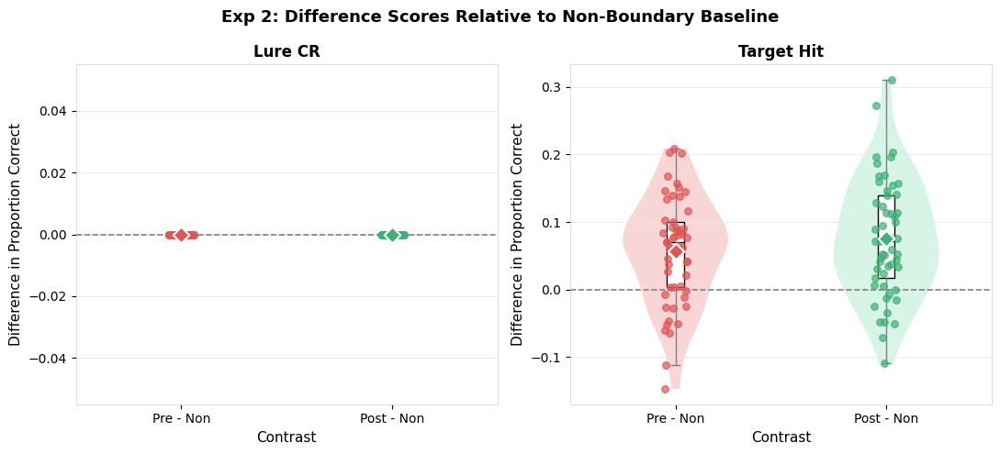
    


## 2.13 SAP 8 — Pre vs Post


```python
paired_test_adaptive(bp_2, "lure_CR",    "Exp 2: Lure CR")
paired_test_adaptive(bp_2, "target_hit", "Exp 2: Target Hit")
```

    
    --- Exp 2: Lure CR: Paired Pre vs Post (SAP 8) ---
      Complete pairs: 53
      SW on diffs: W=1.0000, p=1.0000 → Normal → paired t
      SW on diffs: W=1.0000, p=1.0000 → Normal → paired t
      t=nan, p=nan
    
    --- Exp 2: Target Hit: Paired Pre vs Post (SAP 8) ---
      Complete pairs: 53
      SW on diffs: W=0.9792, p=0.4803 → Normal → paired t
      SW on diffs: W=0.9792, p=0.4803 → Normal → paired t
      t=-1.2331, p=0.2231


## 2.14 SAP 9 — LME Model


```python
run_lme_trial(df_item_labeled, "Exp 2")
```

    
    ═══════════════════════════════════════════════════════
      Exp 2: LME Models (SAP 9)
    ═══════════════════════════════════════════════════════
    
    --- Lure Correct Rejection ---
      Too few participants.
    
    --- Target Hit Rate ---
                             Mixed Linear Model Regression Results
    =======================================================================================
    Model:                       MixedLM           Dependent Variable:           target_hit
    No. Observations:            6995              Method:                       REML      
    No. Groups:                  53                Scale:                        0.2336    
    Min. group size:             103               Log-Likelihood:               inf       
    Max. group size:             383               Converged:                    Yes       
    Mean group size:             132.0                                                     
    ---------------------------------------------------------------------------------------
                                                   Coef. Std.Err.   z   P>|z| [0.025 0.975]
    ---------------------------------------------------------------------------------------
    Intercept                                      0.413                                   
    C(boundary_position, Treatment('Non'))[T.Pre]  0.058    0.015 3.965 0.000  0.029  0.086
    C(boundary_position, Treatment('Non'))[T.Post] 0.077    0.015 5.294 0.000  0.048  0.105
    Group Var                                      0.000                                   
    =======================================================================================
    


## 2.15 SAP 10 — Lure Similarity Bin Analysis


```python
# lure_bin_analysis(df_item_test, df_item_task,
#                    bins_obj=bins_obj_2,
#                    bins_scenes=bins_scenes_2,
#                    exp_label="Exp 2")
```

---
# Experiment 3: Task Only
**Folder:** `../task_only/task_only_data/`  
**Bin file:** `../task_only/Set6 bins_ob.txt` (Objects extended, up to 384 items — no Scenes bin file needed)

## Exp 3 — Load Bin File


```python
bins_obj_3_extended = load_bin_file(data_path("task_only", "Set6 bins_ob.txt"))
print(f"Set6_bins_ob loaded: {len(bins_obj_3_extended)} items  (covers Object numbers 1–384)")
```

    Set6_bins_ob loaded: 384 items  (covers Object numbers 1–384)


## 3.1 Load Task & Test Data


```python
df_task_task, df_task_test = load_experiment(
    task_pattern=data_path("task_only","task_only_data","*task*.csv"),
    test_pattern=data_path("task_only","task_only_data","*test*.csv"),
    exp_label="Experiment 3 (Task-Only)"
)
```

    Experiment 3 (Task-Only)  —  Task files: 53  |  Test files: 53
      Task participants: 48
      Test participants: 48


## 3.2 Participant Cross-Check


```python
in_task_only = set(df_task_task.participant_id.unique()) - set(df_task_test.participant_id.unique())
in_test_only = set(df_task_test.participant_id.unique()) - set(df_task_task.participant_id.unique())
print(f"In task only: {sorted(in_task_only)}")
print(f"In test only: {sorted(in_test_only)}")
```

    In task only: []
    In test only: []


## 3.3 Join Task and Test


```python
df_task_labeled = join_task_test(df_task_task, df_task_test)
print(f"Rows: {len(df_task_labeled)}  |  Participants: {df_task_labeled.participant_id.nunique()}")
```

    Rows: 4448  |  Participants: 48


## 3.4 SAP 2.2 — Normality: Encoding RT


```python
cells_rt_3 = [
    {"vals": grp["rt"].dropna().tolist(), "label": f"{bp} | {st}"}
    for (bp, st), grp in df_task_labeled.groupby(["boundary_position","stimulus_type"], observed=True)
]
normality_table(cells_rt_3, "Exp 3: Shapiro-Wilk — Encoding RT by Cell")
```

    
    ───────────────────────────────────────────────────────
      Exp 3: Shapiro-Wilk — Encoding RT by Cell
    ───────────────────────────────────────────────────────


<style type="text/css">
</style>
<table id="T_4cdf8">
  <thead>
    <tr>
      <th id="T_4cdf8_level0_col0" class="col_heading level0 col0" >Condition</th>
      <th id="T_4cdf8_level0_col1" class="col_heading level0 col1" >n</th>
      <th id="T_4cdf8_level0_col2" class="col_heading level0 col2" >Normal</th>
    </tr>
  </thead>
  <tbody>
    <tr>
      <td id="T_4cdf8_row0_col0" class="data row0 col0" >Non | Target</td>
      <td id="T_4cdf8_row0_col1" class="data row0 col1" >2037</td>
      <td id="T_4cdf8_row0_col2" class="data row0 col2" >No</td>
    </tr>
    <tr>
      <td id="T_4cdf8_row1_col0" class="data row1 col0" >Pre | Target</td>
      <td id="T_4cdf8_row1_col1" class="data row1 col1" >1201</td>
      <td id="T_4cdf8_row1_col2" class="data row1 col2" >No</td>
    </tr>
    <tr>
      <td id="T_4cdf8_row2_col0" class="data row2 col0" >Post | Target</td>
      <td id="T_4cdf8_row2_col1" class="data row2 col1" >1210</td>
      <td id="T_4cdf8_row2_col2" class="data row2 col2" >No</td>
    </tr>
  </tbody>
</table>


<div>
<style scoped>
    .dataframe tbody tr th:only-of-type {
        vertical-align: middle;
    }

    .dataframe tbody tr th {
        vertical-align: top;
    }

    .dataframe thead th {
        text-align: right;
    }
</style>
<table border="1" class="dataframe">
  <thead>
    <tr style="text-align: right;">
      <th></th>
      <th>Condition</th>
      <th>n</th>
      <th>Normal</th>
    </tr>
  </thead>
  <tbody>
    <tr>
      <th>0</th>
      <td>Non | Target</td>
      <td>2037</td>
      <td>No</td>
    </tr>
    <tr>
      <th>1</th>
      <td>Pre | Target</td>
      <td>1201</td>
      <td>No</td>
    </tr>
    <tr>
      <th>2</th>
      <td>Post | Target</td>
      <td>1210</td>
      <td>No</td>
    </tr>
  </tbody>
</table>
</div>


## 3.5 Q-Q Plots


```python
qq_plot_grid(cells_rt_3, ncols=3)
```


    
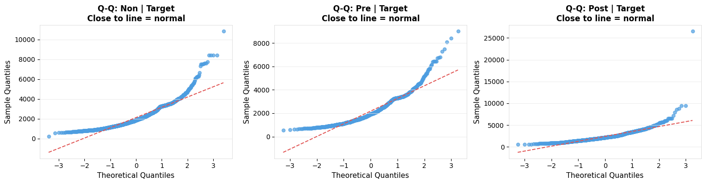
    


## 3.6 SAP 2.3 / 2.4 — RT Analysis


```python
rt_analysis(df_task_labeled, "Experiment 3")
```

    
    ═══════════════════════════════════════════════════════
      Experiment 3: RT Analysis (SAP 2.3/2.4)
      N participants: 48
    ═══════════════════════════════════════════════════════
    Shapiro-Wilk on cell means: W=0.9606, p=0.0004 → Non-normal → KW fallback
    
    --- Kruskal-Wallis: Boundary Position ---
      Kruskal-Wallis  H=6.5957,  p=0.0370  [Boundary Position]
    
    --- Bonferroni Pairwise Wilcoxon: Boundary Position ---
      Bonferroni Pairwise Wilcoxon [Boundary Position]


<style type="text/css">
</style>
<table id="T_04457">
  <thead>
    <tr>
      <th id="T_04457_level0_col0" class="col_heading level0 col0" >Comparison</th>
      <th id="T_04457_level0_col1" class="col_heading level0 col1" >U</th>
      <th id="T_04457_level0_col2" class="col_heading level0 col2" >p_raw</th>
      <th id="T_04457_level0_col3" class="col_heading level0 col3" >p_bonferroni</th>
      <th id="T_04457_level0_col4" class="col_heading level0 col4" >Significant</th>
    </tr>
  </thead>
  <tbody>
    <tr>
      <td id="T_04457_row0_col0" class="data row0 col0" >Non vs Pre</td>
      <td id="T_04457_row0_col1" class="data row0 col1" >1170.000000</td>
      <td id="T_04457_row0_col2" class="data row0 col2" >0.898000</td>
      <td id="T_04457_row0_col3" class="data row0 col3" >1.000000</td>
      <td id="T_04457_row0_col4" class="data row0 col4" >False</td>
    </tr>
    <tr>
      <td id="T_04457_row1_col0" class="data row1 col0" >Non vs Post</td>
      <td id="T_04457_row1_col1" class="data row1 col1" >834.000000</td>
      <td id="T_04457_row1_col2" class="data row1 col2" >0.020000</td>
      <td id="T_04457_row1_col3" class="data row1 col3" >0.060000</td>
      <td id="T_04457_row1_col4" class="data row1 col4" >False</td>
    </tr>
    <tr>
      <td id="T_04457_row2_col0" class="data row2 col0" >Pre vs Post</td>
      <td id="T_04457_row2_col1" class="data row2 col1" >864.000000</td>
      <td id="T_04457_row2_col2" class="data row2 col2" >0.035100</td>
      <td id="T_04457_row2_col3" class="data row2 col3" >0.105300</td>
      <td id="T_04457_row2_col4" class="data row2 col4" >False</td>
    </tr>
  </tbody>
</table>


    
    --- Paired Wilcoxon: Trial Type (Target vs Lure) ---
    
    --- Interaction Proxy: Boundary within Target ---
      Kruskal-Wallis  H=6.5957,  p=0.0370  [Target boundary]
      Bonferroni Pairwise Wilcoxon [Target boundary]


<style type="text/css">
</style>
<table id="T_46a4d">
  <thead>
    <tr>
      <th id="T_46a4d_level0_col0" class="col_heading level0 col0" >Comparison</th>
      <th id="T_46a4d_level0_col1" class="col_heading level0 col1" >U</th>
      <th id="T_46a4d_level0_col2" class="col_heading level0 col2" >p_raw</th>
      <th id="T_46a4d_level0_col3" class="col_heading level0 col3" >p_bonferroni</th>
      <th id="T_46a4d_level0_col4" class="col_heading level0 col4" >Significant</th>
    </tr>
  </thead>
  <tbody>
    <tr>
      <td id="T_46a4d_row0_col0" class="data row0 col0" >Non vs Pre</td>
      <td id="T_46a4d_row0_col1" class="data row0 col1" >1170.000000</td>
      <td id="T_46a4d_row0_col2" class="data row0 col2" >0.898000</td>
      <td id="T_46a4d_row0_col3" class="data row0 col3" >1.000000</td>
      <td id="T_46a4d_row0_col4" class="data row0 col4" >False</td>
    </tr>
    <tr>
      <td id="T_46a4d_row1_col0" class="data row1 col0" >Non vs Post</td>
      <td id="T_46a4d_row1_col1" class="data row1 col1" >834.000000</td>
      <td id="T_46a4d_row1_col2" class="data row1 col2" >0.020000</td>
      <td id="T_46a4d_row1_col3" class="data row1 col3" >0.060000</td>
      <td id="T_46a4d_row1_col4" class="data row1 col4" >False</td>
    </tr>
    <tr>
      <td id="T_46a4d_row2_col0" class="data row2 col0" >Pre vs Post</td>
      <td id="T_46a4d_row2_col1" class="data row2 col1" >864.000000</td>
      <td id="T_46a4d_row2_col2" class="data row2 col2" >0.035100</td>
      <td id="T_46a4d_row2_col3" class="data row2 col3" >0.105300</td>
      <td id="T_46a4d_row2_col4" class="data row2 col4" >False</td>
    </tr>
  </tbody>
</table>


    
    --- Interaction Proxy: Boundary within Lure ---
      Skipped – fewer than 2 groups: Lure boundary
      Skipped – fewer than 2 groups: Lure boundary


## 3.7 RT Descriptives and Plot


```python
summary_table(aggregate_rt(df_task_labeled),
              ["boundary_position","stimulus_type"],
              "mean_rt", "Exp 3: Mean RT per Participant per Cell (ms)")
spaghetti_grouped(
    aggregate_rt(df_task_labeled),
    x_var="boundary_position", y_var="mean_rt", group_var="stimulus_type",
    title="Exp 3: Encoding RT by Boundary Condition",
    subtitle="Thin = participants | Bold = median | Range = IQR",
    x_lab="Boundary Position", y_lab="Mean RT per Participant (ms)"
)
```

    
    ───────────────────────────────────────────────────────
      Exp 3: Mean RT per Participant per Cell (ms)
    ───────────────────────────────────────────────────────


<style type="text/css">
</style>
<table id="T_f0599">
  <thead>
    <tr>
      <th id="T_f0599_level0_col0" class="col_heading level0 col0" >boundary_position</th>
      <th id="T_f0599_level0_col1" class="col_heading level0 col1" >stimulus_type</th>
      <th id="T_f0599_level0_col2" class="col_heading level0 col2" >n</th>
      <th id="T_f0599_level0_col3" class="col_heading level0 col3" >Median</th>
      <th id="T_f0599_level0_col4" class="col_heading level0 col4" >Mean</th>
      <th id="T_f0599_level0_col5" class="col_heading level0 col5" >SD</th>
      <th id="T_f0599_level0_col6" class="col_heading level0 col6" >IQR</th>
    </tr>
  </thead>
  <tbody>
    <tr>
      <td id="T_f0599_row0_col0" class="data row0 col0" >Non</td>
      <td id="T_f0599_row0_col1" class="data row0 col1" >Target</td>
      <td id="T_f0599_row0_col2" class="data row0 col2" >48</td>
      <td id="T_f0599_row0_col3" class="data row0 col3" >2039.122000</td>
      <td id="T_f0599_row0_col4" class="data row0 col4" >2130.131000</td>
      <td id="T_f0599_row0_col5" class="data row0 col5" >533.824000</td>
      <td id="T_f0599_row0_col6" class="data row0 col6" >759.905000</td>
    </tr>
    <tr>
      <td id="T_f0599_row1_col0" class="data row1 col0" >Pre</td>
      <td id="T_f0599_row1_col1" class="data row1 col1" >Target</td>
      <td id="T_f0599_row1_col2" class="data row1 col2" >48</td>
      <td id="T_f0599_row1_col3" class="data row1 col3" >2050.649000</td>
      <td id="T_f0599_row1_col4" class="data row1 col4" >2135.304000</td>
      <td id="T_f0599_row1_col5" class="data row1 col5" >593.213000</td>
      <td id="T_f0599_row1_col6" class="data row1 col6" >770.948000</td>
    </tr>
    <tr>
      <td id="T_f0599_row2_col0" class="data row2 col0" >Post</td>
      <td id="T_f0599_row2_col1" class="data row2 col1" >Target</td>
      <td id="T_f0599_row2_col2" class="data row2 col2" >48</td>
      <td id="T_f0599_row2_col3" class="data row2 col3" >2267.796000</td>
      <td id="T_f0599_row2_col4" class="data row2 col4" >2376.034000</td>
      <td id="T_f0599_row2_col5" class="data row2 col5" >530.718000</td>
      <td id="T_f0599_row2_col6" class="data row2 col6" >819.119000</td>
    </tr>
  </tbody>
</table>


    
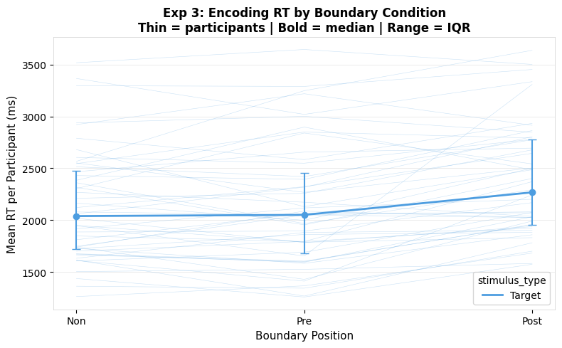
    


## 3.8 SAP 3.1 — REC and LDI


```python
mst_3 = compute_mst_scores(df_task_test)
display(mst_3[["participant_id","REC","LDI"]].round(3))
rec_ldi_plot(mst_3, "Exp 3: REC and LDI")
```


<div>
<style scoped>
    .dataframe tbody tr th:only-of-type {
        vertical-align: middle;
    }

    .dataframe tbody tr th {
        vertical-align: top;
    }

    .dataframe thead th {
        text-align: right;
    }
</style>
<table border="1" class="dataframe">
  <thead>
    <tr style="text-align: right;">
      <th></th>
      <th>participant_id</th>
      <th>REC</th>
      <th>LDI</th>
    </tr>
  </thead>
  <tbody>
    <tr>
      <th>0</th>
      <td>19</td>
      <td>0.3270</td>
      <td>0.1800</td>
    </tr>
    <tr>
      <th>1</th>
      <td>20</td>
      <td>0.3070</td>
      <td>0.1670</td>
    </tr>
    <tr>
      <th>2</th>
      <td>21</td>
      <td>0.2200</td>
      <td>0.2530</td>
    </tr>
    <tr>
      <th>3</th>
      <td>22</td>
      <td>0.3330</td>
      <td>0.2870</td>
    </tr>
    <tr>
      <th>4</th>
      <td>23</td>
      <td>0.2930</td>
      <td>0.2400</td>
    </tr>
    <tr>
      <th>5</th>
      <td>24</td>
      <td>0.2870</td>
      <td>0.3470</td>
    </tr>
    <tr>
      <th>6</th>
      <td>25</td>
      <td>0.2470</td>
      <td>0.2400</td>
    </tr>
    <tr>
      <th>7</th>
      <td>26</td>
      <td>0.3200</td>
      <td>0.2400</td>
    </tr>
    <tr>
      <th>8</th>
      <td>27</td>
      <td>0.2670</td>
      <td>0.2800</td>
    </tr>
    <tr>
      <th>9</th>
      <td>28</td>
      <td>0.3330</td>
      <td>0.3000</td>
    </tr>
    <tr>
      <th>10</th>
      <td>29</td>
      <td>0.2730</td>
      <td>0.2530</td>
    </tr>
    <tr>
      <th>11</th>
      <td>30</td>
      <td>0.1200</td>
      <td>0.2130</td>
    </tr>
    <tr>
      <th>12</th>
      <td>31</td>
      <td>0.2470</td>
      <td>0.1470</td>
    </tr>
    <tr>
      <th>13</th>
      <td>32</td>
      <td>0.2730</td>
      <td>0.2620</td>
    </tr>
    <tr>
      <th>14</th>
      <td>33</td>
      <td>0.3000</td>
      <td>0.2200</td>
    </tr>
    <tr>
      <th>15</th>
      <td>34</td>
      <td>0.1400</td>
      <td>0.1930</td>
    </tr>
    <tr>
      <th>16</th>
      <td>35</td>
      <td>0.2200</td>
      <td>0.2300</td>
    </tr>
    <tr>
      <th>17</th>
      <td>36</td>
      <td>0.2000</td>
      <td>0.2800</td>
    </tr>
    <tr>
      <th>18</th>
      <td>37</td>
      <td>0.2830</td>
      <td>0.2100</td>
    </tr>
    <tr>
      <th>19</th>
      <td>38</td>
      <td>0.3600</td>
      <td>0.2000</td>
    </tr>
    <tr>
      <th>20</th>
      <td>39</td>
      <td>0.3070</td>
      <td>0.3070</td>
    </tr>
    <tr>
      <th>21</th>
      <td>40</td>
      <td>0.3200</td>
      <td>0.1800</td>
    </tr>
    <tr>
      <th>22</th>
      <td>41</td>
      <td>0.1670</td>
      <td>0.2070</td>
    </tr>
    <tr>
      <th>23</th>
      <td>42</td>
      <td>0.1930</td>
      <td>0.1730</td>
    </tr>
    <tr>
      <th>24</th>
      <td>43</td>
      <td>0.2600</td>
      <td>0.2870</td>
    </tr>
    <tr>
      <th>25</th>
      <td>44</td>
      <td>0.2870</td>
      <td>0.1670</td>
    </tr>
    <tr>
      <th>26</th>
      <td>45</td>
      <td>0.2200</td>
      <td>0.1470</td>
    </tr>
    <tr>
      <th>27</th>
      <td>46</td>
      <td>0.2270</td>
      <td>0.2870</td>
    </tr>
    <tr>
      <th>28</th>
      <td>47</td>
      <td>0.3270</td>
      <td>0.2000</td>
    </tr>
    <tr>
      <th>29</th>
      <td>48</td>
      <td>0.1070</td>
      <td>0.1500</td>
    </tr>
    <tr>
      <th>30</th>
      <td>49</td>
      <td>0.2400</td>
      <td>0.2330</td>
    </tr>
    <tr>
      <th>31</th>
      <td>50</td>
      <td>0.2270</td>
      <td>0.2130</td>
    </tr>
    <tr>
      <th>32</th>
      <td>51</td>
      <td>0.2530</td>
      <td>0.2930</td>
    </tr>
    <tr>
      <th>33</th>
      <td>52</td>
      <td>0.3000</td>
      <td>0.2870</td>
    </tr>
    <tr>
      <th>34</th>
      <td>53</td>
      <td>0.2530</td>
      <td>0.2930</td>
    </tr>
    <tr>
      <th>35</th>
      <td>54</td>
      <td>0.1800</td>
      <td>0.1470</td>
    </tr>
    <tr>
      <th>36</th>
      <td>55</td>
      <td>0.3200</td>
      <td>0.0930</td>
    </tr>
    <tr>
      <th>37</th>
      <td>56</td>
      <td>0.2130</td>
      <td>0.3130</td>
    </tr>
    <tr>
      <th>38</th>
      <td>57</td>
      <td>0.2200</td>
      <td>0.2400</td>
    </tr>
    <tr>
      <th>39</th>
      <td>58</td>
      <td>0.2470</td>
      <td>0.2470</td>
    </tr>
    <tr>
      <th>40</th>
      <td>59</td>
      <td>0.3400</td>
      <td>0.3270</td>
    </tr>
    <tr>
      <th>41</th>
      <td>60</td>
      <td>0.3330</td>
      <td>0.2470</td>
    </tr>
    <tr>
      <th>42</th>
      <td>61</td>
      <td>0.3530</td>
      <td>0.2200</td>
    </tr>
    <tr>
      <th>43</th>
      <td>62</td>
      <td>0.3330</td>
      <td>0.2000</td>
    </tr>
    <tr>
      <th>44</th>
      <td>63</td>
      <td>0.2330</td>
      <td>0.1730</td>
    </tr>
    <tr>
      <th>45</th>
      <td>64</td>
      <td>0.2000</td>
      <td>0.3270</td>
    </tr>
    <tr>
      <th>46</th>
      <td>65</td>
      <td>0.1730</td>
      <td>0.3130</td>
    </tr>
    <tr>
      <th>47</th>
      <td>69</td>
      <td>0.2400</td>
      <td>0.2000</td>
    </tr>
  </tbody>
</table>
</div>


    
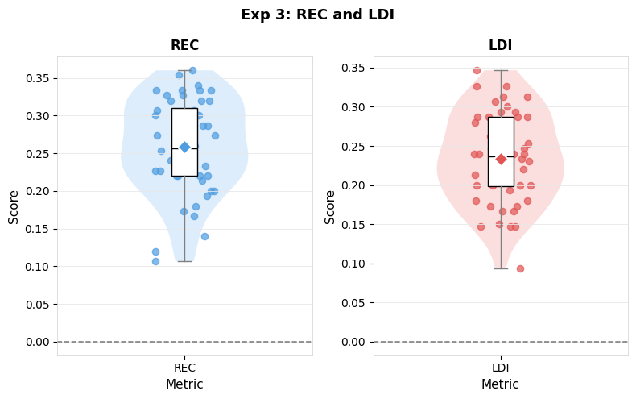
    


## 3.9 SAP 3.2 / 4 — Memory Accuracy


```python
bp_3 = compute_accuracy(df_task_test, df_task_task)
print(f"Participants: {bp_3.participant_id.nunique()}")
summary_table(bp_3, "boundary_position", "lure_CR",    "Exp 3: Lure CR")
summary_table(bp_3, "boundary_position", "target_hit", "Exp 3: Target Hit")
```

    Participants: 48
    
    ───────────────────────────────────────────────────────
      Exp 3: Lure CR
    ───────────────────────────────────────────────────────


<style type="text/css">
</style>
<table id="T_b80f0">
  <thead>
    <tr>
      <th id="T_b80f0_level0_col0" class="col_heading level0 col0" >boundary_position</th>
      <th id="T_b80f0_level0_col1" class="col_heading level0 col1" >n</th>
      <th id="T_b80f0_level0_col2" class="col_heading level0 col2" >Median</th>
      <th id="T_b80f0_level0_col3" class="col_heading level0 col3" >Mean</th>
      <th id="T_b80f0_level0_col4" class="col_heading level0 col4" >SD</th>
      <th id="T_b80f0_level0_col5" class="col_heading level0 col5" >IQR</th>
    </tr>
  </thead>
  <tbody>
    <tr>
      <td id="T_b80f0_row0_col0" class="data row0 col0" >Non</td>
      <td id="T_b80f0_row0_col1" class="data row0 col1" >48</td>
      <td id="T_b80f0_row0_col2" class="data row0 col2" >0.000000</td>
      <td id="T_b80f0_row0_col3" class="data row0 col3" >0.000000</td>
      <td id="T_b80f0_row0_col4" class="data row0 col4" >0.000000</td>
      <td id="T_b80f0_row0_col5" class="data row0 col5" >0.000000</td>
    </tr>
    <tr>
      <td id="T_b80f0_row1_col0" class="data row1 col0" >Pre</td>
      <td id="T_b80f0_row1_col1" class="data row1 col1" >48</td>
      <td id="T_b80f0_row1_col2" class="data row1 col2" >0.000000</td>
      <td id="T_b80f0_row1_col3" class="data row1 col3" >0.000000</td>
      <td id="T_b80f0_row1_col4" class="data row1 col4" >0.000000</td>
      <td id="T_b80f0_row1_col5" class="data row1 col5" >0.000000</td>
    </tr>
    <tr>
      <td id="T_b80f0_row2_col0" class="data row2 col0" >Post</td>
      <td id="T_b80f0_row2_col1" class="data row2 col1" >48</td>
      <td id="T_b80f0_row2_col2" class="data row2 col2" >0.000000</td>
      <td id="T_b80f0_row2_col3" class="data row2 col3" >0.000000</td>
      <td id="T_b80f0_row2_col4" class="data row2 col4" >0.000000</td>
      <td id="T_b80f0_row2_col5" class="data row2 col5" >0.000000</td>
    </tr>
  </tbody>
</table>


    
    ───────────────────────────────────────────────────────
      Exp 3: Target Hit
    ───────────────────────────────────────────────────────


<style type="text/css">
</style>
<table id="T_fd3c6">
  <thead>
    <tr>
      <th id="T_fd3c6_level0_col0" class="col_heading level0 col0" >boundary_position</th>
      <th id="T_fd3c6_level0_col1" class="col_heading level0 col1" >n</th>
      <th id="T_fd3c6_level0_col2" class="col_heading level0 col2" >Median</th>
      <th id="T_fd3c6_level0_col3" class="col_heading level0 col3" >Mean</th>
      <th id="T_fd3c6_level0_col4" class="col_heading level0 col4" >SD</th>
      <th id="T_fd3c6_level0_col5" class="col_heading level0 col5" >IQR</th>
    </tr>
  </thead>
  <tbody>
    <tr>
      <td id="T_fd3c6_row0_col0" class="data row0 col0" >Non</td>
      <td id="T_fd3c6_row0_col1" class="data row0 col1" >48</td>
      <td id="T_fd3c6_row0_col2" class="data row0 col2" >0.415000</td>
      <td id="T_fd3c6_row0_col3" class="data row0 col3" >0.414000</td>
      <td id="T_fd3c6_row0_col4" class="data row0 col4" >0.118000</td>
      <td id="T_fd3c6_row0_col5" class="data row0 col5" >0.157000</td>
    </tr>
    <tr>
      <td id="T_fd3c6_row1_col0" class="data row1 col0" >Pre</td>
      <td id="T_fd3c6_row1_col1" class="data row1 col1" >48</td>
      <td id="T_fd3c6_row1_col2" class="data row1 col2" >0.591000</td>
      <td id="T_fd3c6_row1_col3" class="data row1 col3" >0.594000</td>
      <td id="T_fd3c6_row1_col4" class="data row1 col4" >0.161000</td>
      <td id="T_fd3c6_row1_col5" class="data row1 col5" >0.218000</td>
    </tr>
    <tr>
      <td id="T_fd3c6_row2_col0" class="data row2 col0" >Post</td>
      <td id="T_fd3c6_row2_col1" class="data row2 col1" >48</td>
      <td id="T_fd3c6_row2_col2" class="data row2 col2" >0.564000</td>
      <td id="T_fd3c6_row2_col3" class="data row2 col3" >0.540000</td>
      <td id="T_fd3c6_row2_col4" class="data row2 col4" >0.158000</td>
      <td id="T_fd3c6_row2_col5" class="data row2 col5" >0.203000</td>
    </tr>
  </tbody>
</table>


<div>
<style scoped>
    .dataframe tbody tr th:only-of-type {
        vertical-align: middle;
    }

    .dataframe tbody tr th {
        vertical-align: top;
    }

    .dataframe thead th {
        text-align: right;
    }
</style>
<table border="1" class="dataframe">
  <thead>
    <tr style="text-align: right;">
      <th></th>
      <th>boundary_position</th>
      <th>n</th>
      <th>Median</th>
      <th>Mean</th>
      <th>SD</th>
      <th>IQR</th>
    </tr>
  </thead>
  <tbody>
    <tr>
      <th>0</th>
      <td>Non</td>
      <td>48</td>
      <td>0.4150</td>
      <td>0.4140</td>
      <td>0.1180</td>
      <td>0.1570</td>
    </tr>
    <tr>
      <th>1</th>
      <td>Pre</td>
      <td>48</td>
      <td>0.5910</td>
      <td>0.5940</td>
      <td>0.1610</td>
      <td>0.2180</td>
    </tr>
    <tr>
      <th>2</th>
      <td>Post</td>
      <td>48</td>
      <td>0.5640</td>
      <td>0.5400</td>
      <td>0.1580</td>
      <td>0.2030</td>
    </tr>
  </tbody>
</table>
</div>


## 3.10 Accuracy Plots


```python
spaghetti_plot(bp_3, "boundary_position", "lure_CR",
               title="Exp 3: Lure Correct Rejection", x_lab="Boundary Position", y_lab="Proportion Correct")
spaghetti_plot(bp_3, "boundary_position", "target_hit",
               title="Exp 3: Target Hit Rate", x_lab="Boundary Position", y_lab="Proportion Correct")
```


    

    


    
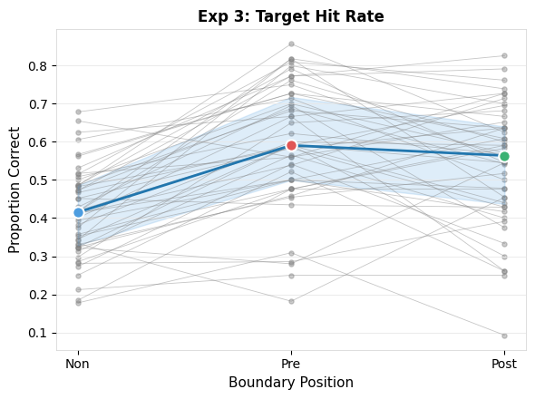
    


## 3.11 SAP 5 / 6 — RM Analysis


```python
rm_analysis(bp_3, "lure_CR",    label="Exp 3: Lure CR")
rm_analysis(bp_3, "target_hit", label="Exp 3: Target Hit")
```

    
    ───────────────────────────────────────────────────────
      Exp 3: Lure CR: RM Analysis — DV: lure_CR
    ───────────────────────────────────────────────────────
      Participants included: 48  |  Dropped: 0
      Friedman: stat=nan, p=nan
    
      Bonferroni pairwise Wilcoxon (SAP 6):


<style type="text/css">
</style>
<table id="T_7f4cd">
  <thead>
    <tr>
      <th id="T_7f4cd_level0_col0" class="col_heading level0 col0" >Comparison</th>
      <th id="T_7f4cd_level0_col1" class="col_heading level0 col1" >W</th>
      <th id="T_7f4cd_level0_col2" class="col_heading level0 col2" >p_raw</th>
      <th id="T_7f4cd_level0_col3" class="col_heading level0 col3" >p_bonferroni</th>
      <th id="T_7f4cd_level0_col4" class="col_heading level0 col4" >Significant</th>
    </tr>
  </thead>
  <tbody>
    <tr>
      <td id="T_7f4cd_row0_col0" class="data row0 col0" >Non vs Pre</td>
      <td id="T_7f4cd_row0_col1" class="data row0 col1" >0.000000</td>
      <td id="T_7f4cd_row0_col2" class="data row0 col2" >nan</td>
      <td id="T_7f4cd_row0_col3" class="data row0 col3" >nan</td>
      <td id="T_7f4cd_row0_col4" class="data row0 col4" >False</td>
    </tr>
    <tr>
      <td id="T_7f4cd_row1_col0" class="data row1 col0" >Non vs Post</td>
      <td id="T_7f4cd_row1_col1" class="data row1 col1" >0.000000</td>
      <td id="T_7f4cd_row1_col2" class="data row1 col2" >nan</td>
      <td id="T_7f4cd_row1_col3" class="data row1 col3" >nan</td>
      <td id="T_7f4cd_row1_col4" class="data row1 col4" >False</td>
    </tr>
    <tr>
      <td id="T_7f4cd_row2_col0" class="data row2 col0" >Pre vs Post</td>
      <td id="T_7f4cd_row2_col1" class="data row2 col1" >0.000000</td>
      <td id="T_7f4cd_row2_col2" class="data row2 col2" >nan</td>
      <td id="T_7f4cd_row2_col3" class="data row2 col3" >nan</td>
      <td id="T_7f4cd_row2_col4" class="data row2 col4" >False</td>
    </tr>
  </tbody>
</table>


    
    ───────────────────────────────────────────────────────
      Exp 3: Target Hit: RM Analysis — DV: target_hit
    ───────────────────────────────────────────────────────
      Participants included: 48  |  Dropped: 0
      Shapiro-Wilk: W=0.9892, p=0.3295 → Normal → RM-ANOVA


<div>
<style scoped>
    .dataframe tbody tr th:only-of-type {
        vertical-align: middle;
    }

    .dataframe tbody tr th {
        vertical-align: top;
    }

    .dataframe thead th {
        text-align: right;
    }
</style>
<table border="1" class="dataframe">
  <thead>
    <tr style="text-align: right;">
      <th></th>
      <th>Source</th>
      <th>SS</th>
      <th>DF</th>
      <th>MS</th>
      <th>F</th>
      <th>p_unc</th>
      <th>ng2</th>
      <th>eps</th>
    </tr>
  </thead>
  <tbody>
    <tr>
      <th>0</th>
      <td>boundary_position</td>
      <td>0.8145</td>
      <td>2</td>
      <td>0.4072</td>
      <td>39.8806</td>
      <td>0.0000</td>
      <td>0.2107</td>
      <td>0.9368</td>
    </tr>
    <tr>
      <th>1</th>
      <td>Error</td>
      <td>0.9599</td>
      <td>94</td>
      <td>0.0102</td>
      <td>NaN</td>
      <td>NaN</td>
      <td>NaN</td>
      <td>NaN</td>
    </tr>
  </tbody>
</table>
</div>


    
      Bonferroni pairwise t-tests (SAP 6):


<style type="text/css">
</style>
<table id="T_880d8">
  <thead>
    <tr>
      <th id="T_880d8_level0_col0" class="col_heading level0 col0" >Comparison</th>
      <th id="T_880d8_level0_col1" class="col_heading level0 col1" >t</th>
      <th id="T_880d8_level0_col2" class="col_heading level0 col2" >p_raw</th>
      <th id="T_880d8_level0_col3" class="col_heading level0 col3" >p_bonferroni</th>
      <th id="T_880d8_level0_col4" class="col_heading level0 col4" >Significant</th>
    </tr>
  </thead>
  <tbody>
    <tr>
      <td id="T_880d8_row0_col0" class="data row0 col0" >Non vs Pre</td>
      <td id="T_880d8_row0_col1" class="data row0 col1" >-6.218000</td>
      <td id="T_880d8_row0_col2" class="data row0 col2" >0.000000</td>
      <td id="T_880d8_row0_col3" class="data row0 col3" >0.000000</td>
      <td id="T_880d8_row0_col4" class="data row0 col4" >True</td>
    </tr>
    <tr>
      <td id="T_880d8_row1_col0" class="data row1 col0" >Non vs Post</td>
      <td id="T_880d8_row1_col1" class="data row1 col1" >-4.434000</td>
      <td id="T_880d8_row1_col2" class="data row1 col2" >0.000000</td>
      <td id="T_880d8_row1_col3" class="data row1 col3" >0.000000</td>
      <td id="T_880d8_row1_col4" class="data row1 col4" >True</td>
    </tr>
    <tr>
      <td id="T_880d8_row2_col0" class="data row2 col0" >Pre vs Post</td>
      <td id="T_880d8_row2_col1" class="data row2 col1" >1.631000</td>
      <td id="T_880d8_row2_col2" class="data row2 col2" >0.106200</td>
      <td id="T_880d8_row2_col3" class="data row2 col3" >0.318600</td>
      <td id="T_880d8_row2_col4" class="data row2 col4" >False</td>
    </tr>
  </tbody>
</table>


<div>
<style scoped>
    .dataframe tbody tr th:only-of-type {
        vertical-align: middle;
    }

    .dataframe tbody tr th {
        vertical-align: top;
    }

    .dataframe thead th {
        text-align: right;
    }
</style>
<table border="1" class="dataframe">
  <thead>
    <tr style="text-align: right;">
      <th></th>
      <th>participant_id</th>
      <th>boundary_position</th>
      <th>target_hit</th>
    </tr>
  </thead>
  <tbody>
    <tr>
      <th>0</th>
      <td>19</td>
      <td>Non</td>
      <td>0.4865</td>
    </tr>
    <tr>
      <th>1</th>
      <td>19</td>
      <td>Pre</td>
      <td>0.7917</td>
    </tr>
    <tr>
      <th>2</th>
      <td>19</td>
      <td>Post</td>
      <td>0.5455</td>
    </tr>
    <tr>
      <th>3</th>
      <td>20</td>
      <td>Non</td>
      <td>0.4857</td>
    </tr>
    <tr>
      <th>4</th>
      <td>20</td>
      <td>Pre</td>
      <td>0.6818</td>
    </tr>
    <tr>
      <th>...</th>
      <td>...</td>
      <td>...</td>
      <td>...</td>
    </tr>
    <tr>
      <th>139</th>
      <td>65</td>
      <td>Pre</td>
      <td>0.5217</td>
    </tr>
    <tr>
      <th>140</th>
      <td>65</td>
      <td>Post</td>
      <td>0.2609</td>
    </tr>
    <tr>
      <th>141</th>
      <td>69</td>
      <td>Non</td>
      <td>0.3529</td>
    </tr>
    <tr>
      <th>142</th>
      <td>69</td>
      <td>Pre</td>
      <td>0.4762</td>
    </tr>
    <tr>
      <th>143</th>
      <td>69</td>
      <td>Post</td>
      <td>0.5833</td>
    </tr>
  </tbody>
</table>
<p>144 rows × 3 columns</p>
</div>


## 3.12 SAP 7 / 7.1 — Difference Scores


```python
diff_3 = compute_diff_scores(bp_3)
display(diff_3[["participant_id","lure_pre_diff","lure_post_diff",
                "target_pre_diff","target_post_diff"]].round(3))
one_sample_test_adaptive(diff_3.lure_pre_diff,    "Lure CR: Pre - Non (Exp 3)")
one_sample_test_adaptive(diff_3.lure_post_diff,   "Lure CR: Post - Non (Exp 3)")
one_sample_test_adaptive(diff_3.target_pre_diff,  "Target Hit: Pre - Non (Exp 3)")
one_sample_test_adaptive(diff_3.target_post_diff, "Target Hit: Post - Non (Exp 3)")
diff_score_plot(diff_3, "Exp 3: Difference Scores Relative to Non-Boundary Baseline")
```


<div>
<style scoped>
    .dataframe tbody tr th:only-of-type {
        vertical-align: middle;
    }

    .dataframe tbody tr th {
        vertical-align: top;
    }

    .dataframe thead th {
        text-align: right;
    }
</style>
<table border="1" class="dataframe">
  <thead>
    <tr style="text-align: right;">
      <th></th>
      <th>participant_id</th>
      <th>lure_pre_diff</th>
      <th>lure_post_diff</th>
      <th>target_pre_diff</th>
      <th>target_post_diff</th>
    </tr>
  </thead>
  <tbody>
    <tr>
      <th>0</th>
      <td>19</td>
      <td>0.0000</td>
      <td>0.0000</td>
      <td>0.3050</td>
      <td>0.0590</td>
    </tr>
    <tr>
      <th>1</th>
      <td>20</td>
      <td>0.0000</td>
      <td>0.0000</td>
      <td>0.1960</td>
      <td>0.1510</td>
    </tr>
    <tr>
      <th>2</th>
      <td>21</td>
      <td>0.0000</td>
      <td>0.0000</td>
      <td>0.1430</td>
      <td>0.1210</td>
    </tr>
    <tr>
      <th>3</th>
      <td>22</td>
      <td>0.0000</td>
      <td>0.0000</td>
      <td>0.4020</td>
      <td>0.3220</td>
    </tr>
    <tr>
      <th>4</th>
      <td>23</td>
      <td>0.0000</td>
      <td>0.0000</td>
      <td>0.4580</td>
      <td>0.3580</td>
    </tr>
    <tr>
      <th>5</th>
      <td>24</td>
      <td>0.0000</td>
      <td>0.0000</td>
      <td>0.1270</td>
      <td>0.3030</td>
    </tr>
    <tr>
      <th>6</th>
      <td>25</td>
      <td>0.0000</td>
      <td>0.0000</td>
      <td>0.1320</td>
      <td>-0.0230</td>
    </tr>
    <tr>
      <th>7</th>
      <td>26</td>
      <td>0.0000</td>
      <td>0.0000</td>
      <td>-0.0950</td>
      <td>-0.0030</td>
    </tr>
    <tr>
      <th>8</th>
      <td>27</td>
      <td>0.0000</td>
      <td>0.0000</td>
      <td>0.4430</td>
      <td>0.0800</td>
    </tr>
    <tr>
      <th>9</th>
      <td>28</td>
      <td>0.0000</td>
      <td>0.0000</td>
      <td>0.3720</td>
      <td>0.1400</td>
    </tr>
    <tr>
      <th>10</th>
      <td>29</td>
      <td>0.0000</td>
      <td>0.0000</td>
      <td>0.2180</td>
      <td>0.2090</td>
    </tr>
    <tr>
      <th>11</th>
      <td>30</td>
      <td>0.0000</td>
      <td>0.0000</td>
      <td>0.0380</td>
      <td>0.0380</td>
    </tr>
    <tr>
      <th>12</th>
      <td>31</td>
      <td>0.0000</td>
      <td>0.0000</td>
      <td>0.2000</td>
      <td>0.0710</td>
    </tr>
    <tr>
      <th>13</th>
      <td>32</td>
      <td>0.0000</td>
      <td>0.0000</td>
      <td>0.1130</td>
      <td>0.0600</td>
    </tr>
    <tr>
      <th>14</th>
      <td>33</td>
      <td>0.0000</td>
      <td>0.0000</td>
      <td>0.0430</td>
      <td>0.2100</td>
    </tr>
    <tr>
      <th>15</th>
      <td>34</td>
      <td>0.0000</td>
      <td>0.0000</td>
      <td>-0.1520</td>
      <td>0.1210</td>
    </tr>
    <tr>
      <th>16</th>
      <td>35</td>
      <td>0.0000</td>
      <td>0.0000</td>
      <td>0.1240</td>
      <td>0.1870</td>
    </tr>
    <tr>
      <th>17</th>
      <td>36</td>
      <td>0.0000</td>
      <td>0.0000</td>
      <td>0.2670</td>
      <td>-0.0240</td>
    </tr>
    <tr>
      <th>18</th>
      <td>37</td>
      <td>0.0000</td>
      <td>0.0000</td>
      <td>0.2150</td>
      <td>0.0700</td>
    </tr>
    <tr>
      <th>19</th>
      <td>38</td>
      <td>0.0000</td>
      <td>0.0000</td>
      <td>0.3010</td>
      <td>0.3540</td>
    </tr>
    <tr>
      <th>20</th>
      <td>39</td>
      <td>0.0000</td>
      <td>0.0000</td>
      <td>0.3450</td>
      <td>0.1830</td>
    </tr>
    <tr>
      <th>21</th>
      <td>40</td>
      <td>0.0000</td>
      <td>0.0000</td>
      <td>0.1610</td>
      <td>0.0420</td>
    </tr>
    <tr>
      <th>22</th>
      <td>41</td>
      <td>0.0000</td>
      <td>0.0000</td>
      <td>0.0040</td>
      <td>0.1100</td>
    </tr>
    <tr>
      <th>23</th>
      <td>42</td>
      <td>0.0000</td>
      <td>0.0000</td>
      <td>0.2690</td>
      <td>0.0610</td>
    </tr>
    <tr>
      <th>24</th>
      <td>43</td>
      <td>0.0000</td>
      <td>0.0000</td>
      <td>0.3530</td>
      <td>0.3850</td>
    </tr>
    <tr>
      <th>25</th>
      <td>44</td>
      <td>0.0000</td>
      <td>0.0000</td>
      <td>0.1010</td>
      <td>0.1540</td>
    </tr>
    <tr>
      <th>26</th>
      <td>45</td>
      <td>0.0000</td>
      <td>0.0000</td>
      <td>0.1900</td>
      <td>0.3050</td>
    </tr>
    <tr>
      <th>27</th>
      <td>46</td>
      <td>0.0000</td>
      <td>0.0000</td>
      <td>0.2460</td>
      <td>0.0950</td>
    </tr>
    <tr>
      <th>28</th>
      <td>47</td>
      <td>0.0000</td>
      <td>0.0000</td>
      <td>0.1650</td>
      <td>0.1040</td>
    </tr>
    <tr>
      <th>29</th>
      <td>48</td>
      <td>0.0000</td>
      <td>0.0000</td>
      <td>0.1320</td>
      <td>-0.0850</td>
    </tr>
    <tr>
      <th>30</th>
      <td>49</td>
      <td>0.0000</td>
      <td>0.0000</td>
      <td>0.1350</td>
      <td>0.3130</td>
    </tr>
    <tr>
      <th>31</th>
      <td>50</td>
      <td>0.0000</td>
      <td>0.0000</td>
      <td>0.2670</td>
      <td>-0.1390</td>
    </tr>
    <tr>
      <th>32</th>
      <td>51</td>
      <td>0.0000</td>
      <td>0.0000</td>
      <td>0.1060</td>
      <td>0.2150</td>
    </tr>
    <tr>
      <th>33</th>
      <td>52</td>
      <td>0.0000</td>
      <td>0.0000</td>
      <td>0.1240</td>
      <td>0.2290</td>
    </tr>
    <tr>
      <th>34</th>
      <td>53</td>
      <td>0.0000</td>
      <td>0.0000</td>
      <td>0.1720</td>
      <td>0.1260</td>
    </tr>
    <tr>
      <th>35</th>
      <td>54</td>
      <td>0.0000</td>
      <td>0.0000</td>
      <td>0.2920</td>
      <td>0.2920</td>
    </tr>
    <tr>
      <th>36</th>
      <td>55</td>
      <td>0.0000</td>
      <td>0.0000</td>
      <td>0.1080</td>
      <td>-0.1060</td>
    </tr>
    <tr>
      <th>37</th>
      <td>56</td>
      <td>0.0000</td>
      <td>0.0000</td>
      <td>0.0860</td>
      <td>0.0030</td>
    </tr>
    <tr>
      <th>38</th>
      <td>57</td>
      <td>0.0000</td>
      <td>0.0000</td>
      <td>0.2530</td>
      <td>0.0880</td>
    </tr>
    <tr>
      <th>39</th>
      <td>58</td>
      <td>0.0000</td>
      <td>0.0000</td>
      <td>0.2670</td>
      <td>-0.0540</td>
    </tr>
    <tr>
      <th>40</th>
      <td>59</td>
      <td>0.0000</td>
      <td>0.0000</td>
      <td>0.0710</td>
      <td>-0.1190</td>
    </tr>
    <tr>
      <th>41</th>
      <td>60</td>
      <td>0.0000</td>
      <td>0.0000</td>
      <td>0.2940</td>
      <td>0.2470</td>
    </tr>
    <tr>
      <th>42</th>
      <td>61</td>
      <td>0.0000</td>
      <td>0.0000</td>
      <td>0.2410</td>
      <td>0.2600</td>
    </tr>
    <tr>
      <th>43</th>
      <td>62</td>
      <td>0.0000</td>
      <td>0.0000</td>
      <td>0.0420</td>
      <td>0.1020</td>
    </tr>
    <tr>
      <th>44</th>
      <td>63</td>
      <td>0.0000</td>
      <td>0.0000</td>
      <td>-0.0170</td>
      <td>-0.0230</td>
    </tr>
    <tr>
      <th>45</th>
      <td>64</td>
      <td>0.0000</td>
      <td>0.0000</td>
      <td>-0.0430</td>
      <td>0.2230</td>
    </tr>
    <tr>
      <th>46</th>
      <td>65</td>
      <td>0.0000</td>
      <td>0.0000</td>
      <td>0.2720</td>
      <td>0.0110</td>
    </tr>
    <tr>
      <th>47</th>
      <td>69</td>
      <td>0.0000</td>
      <td>0.0000</td>
      <td>0.1230</td>
      <td>0.2300</td>
    </tr>
  </tbody>
</table>
</div>


    
    --- Lure CR: Pre - Non (Exp 3) ---
      SW: W=1.0000, p=1.0000 → Normal → one-sample t
      t=nan, p=nan, mean=0.0000
    
    --- Lure CR: Post - Non (Exp 3) ---
      SW: W=1.0000, p=1.0000 → Normal → one-sample t
      t=nan, p=nan, mean=0.0000
    
    --- Target Hit: Pre - Non (Exp 3) ---
      SW: W=0.9889, p=0.9277 → Normal → one-sample t
      t=9.3656, p=0.0000, mean=0.1793
    
    --- Target Hit: Post - Non (Exp 3) ---
      SW: W=0.9812, p=0.6311 → Normal → one-sample t
      t=6.5241, p=0.0000, mean=0.1261


    
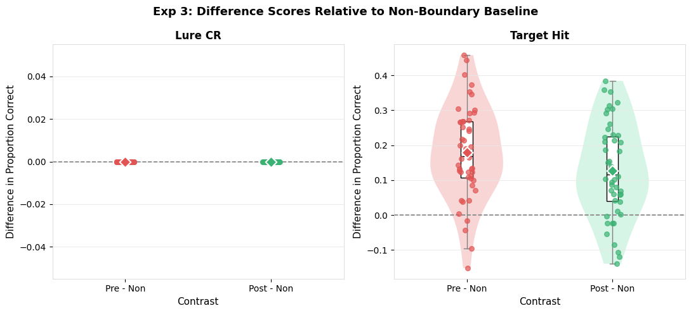
    


## 3.13 SAP 8 — Pre vs Post


```python
paired_test_adaptive(bp_3, "lure_CR",    "Exp 3: Lure CR")
paired_test_adaptive(bp_3, "target_hit", "Exp 3: Target Hit")
```

    
    --- Exp 3: Lure CR: Paired Pre vs Post (SAP 8) ---
      Complete pairs: 48
      SW on diffs: W=1.0000, p=1.0000 → Normal → paired t
      SW on diffs: W=1.0000, p=1.0000 → Normal → paired t
      t=nan, p=nan
    
    --- Exp 3: Target Hit: Paired Pre vs Post (SAP 8) ---
      Complete pairs: 48
      SW on diffs: W=0.9891, p=0.9314 → Normal → paired t
      SW on diffs: W=0.9891, p=0.9314 → Normal → paired t
      t=2.2983, p=0.0260


## 3.14 SAP 9 — LME Model


```python
run_lme_trial(df_task_labeled, "Exp 3")
```

    
    ═══════════════════════════════════════════════════════
      Exp 3: LME Models (SAP 9)
    ═══════════════════════════════════════════════════════
    
    --- Lure Correct Rejection ---
      Too few participants.
    
    --- Target Hit Rate ---
                             Mixed Linear Model Regression Results
    ========================================================================================
    Model:                        MixedLM           Dependent Variable:           target_hit
    No. Observations:             4448              Method:                       REML      
    No. Groups:                   48                Scale:                        0.2332    
    Min. group size:              63                Log-Likelihood:               -3119.8277
    Max. group size:              345               Converged:                    Yes       
    Mean group size:              92.7                                                      
    ----------------------------------------------------------------------------------------
                                                   Coef. Std.Err.   z    P>|z| [0.025 0.975]
    ----------------------------------------------------------------------------------------
    Intercept                                      0.425    0.019 22.886 0.000  0.388  0.461
    C(boundary_position, Treatment('Non'))[T.Pre]  0.167    0.018  9.439 0.000  0.132  0.202
    C(boundary_position, Treatment('Non'))[T.Post] 0.110    0.018  6.255 0.000  0.076  0.145
    Group Var                                      0.010    0.006                           
    ========================================================================================
    


## 3.15 SAP 10 — Lure Similarity Bin Analysis


```python
# # Task-only uses extended bin file (384 items, Objects only — no Scenes in this experiment)
# lure_bin_analysis(df_task_test, df_task_task,
#                    bins_obj=bins_obj_3_extended,
#                    bins_scenes={},           # no Scenes in task_only
#                    bins_obj_extended=bins_obj_3_extended,
#                    exp_label="Exp 3")
```
